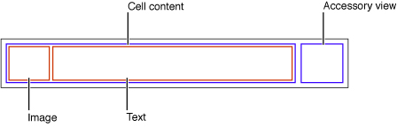

# Displaying Collections in UIKit

## Lesson Overview
| **Time(min)** | **Activity**                            |
| ------------- | ----------------------------------------|
| 5             | Review of Last Class & Objectives       |
| 10            | TT Tableviews                           |
| 20            | MVC Demo                                |
| 10            | Break                                   |
| 20            | Other architectural patterns            |
| 35            | Share & Discuss patterns                |
| 5             | Wrap up                                 |

## Objectives & Competencies
By the end of this lesson, students should be able to:

- Setup and display a list of data in a UITableView
- Identify the components of a UITableView (datasource & delegate)
- Select elements in a UITableView
- Use extensions to structure code

## UITableView

A view that presents data (a list of items) using rows arranged in a *single column*.

`UITableView` is a subclass of `UIScrollView`, this allows users to scroll through the elements in the table in vertical direction.

Each individual item of the table is a `UITableViewCell` object. A cell object has various parts but most of it is reserved for its content: text, image, or any other kind of distinctive identifier.

When a cell object is reusable (the typical case) you assign it a *reuse identifier* in the storyboard. At runtime, the table view stores cell objects in an internal queue. When the table view asks the data source to configure a cell object for display, the data source can access the queued object by sending a `dequeueReusableCellWithIdentifier:` message to the table view, passing in a reuse identifier. The data source sets the content of the cell and any special properties before returning it. This reuse of cell objects is a performance enhancement because it eliminates the overhead of cell creation.

When providing cells for the table view, there are three general approaches you can take.

- You can use ready-made cell objects in a range of styles.
- You can add your own subviews to the cell object’s content view.
- Use cell objects created from a custom subclass of UITableViewCell.

A table view is made up of zero or more *sections*, each with its own *rows*. Sections are identified by their index number within the table view, and rows are identified by their index number within a section. Sections have headers that appear at the top of each group and include a title. The footer appears below each group and also has a title. The entire table can also have its own header and footer.

Table views can have one of two styles, `UITableView.Style.plain` and `UITableView.Style.grouped`.

A `UITableView` object must have an object that acts as a *data source* and an object that acts as a *delegate*.  

The data source must adopt the `UITableViewDataSource` protocol and provides information needed to construct tables and manages the data model when rows of a table are inserted, deleted, or reordered. It manages how many sections the table has, how many rows per section and handles how cells are drawn.

The delegate must adopt the `UITableViewDelegate protocol`. Manages table row configuration and selection, row reordering, highlighting, accessory views, and editing operations.

Note: You decide how to structure you code. When using UITableViews some people prefer to include both protocol implementations inside an extension. This helps a lot with code readability. But take into consideration that using too many extensions increases the project build time. It's a personal choice between clear and readable code vs improvement in build time.

## Baseline Challenges

For the upcoming classes we'll be building an app to track the user's daily mood. This first part will cover:

- Creating a new Xcode Project
- Setting up the model needed
- Displaying a table
- Handling table events

Create a new project and follow the implementation for this part here: [Mood Tracker Part 1](https://github.com/Product-College-Labs/mood-tracker/blob/master/content/5.1-content.md)
