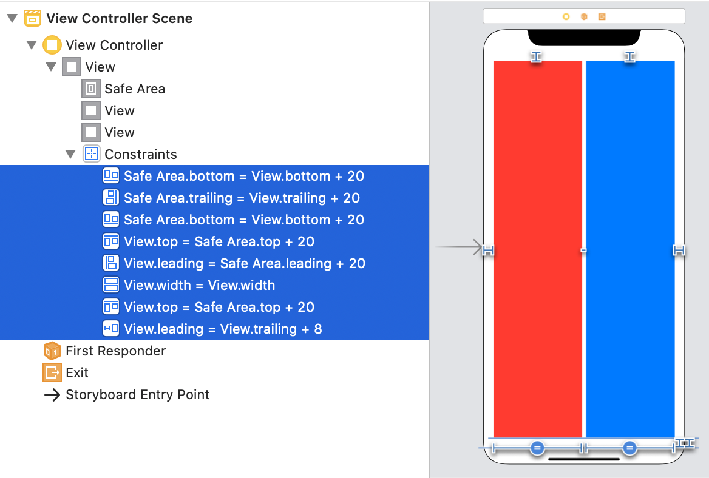
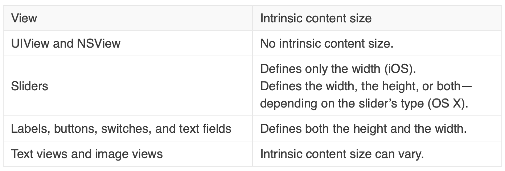
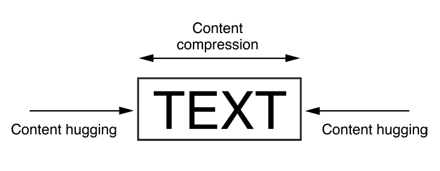
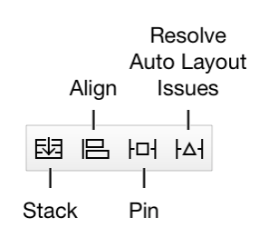
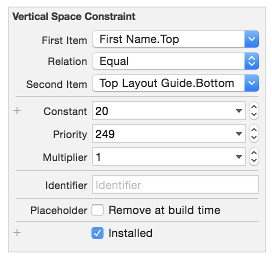
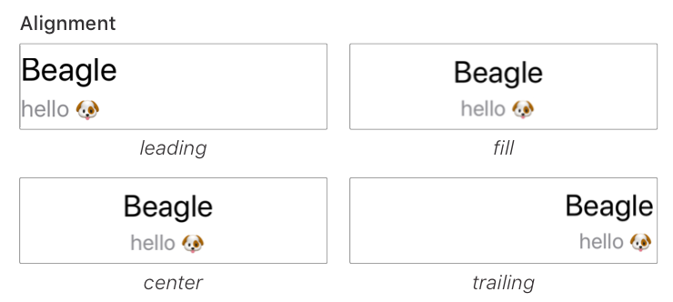
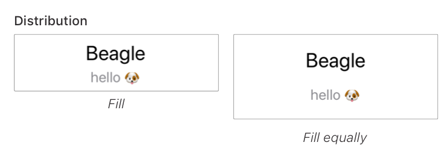

<!-- Run this slideshow via the following command: -->
<!-- reveal-md README.md -w -->

<!-- .slide: class="header" -->
# Autolayout Pt.1

## [Slides](https://make-school-courses.github.io/MOB-1.2-Introduction-to-iOS-Development/Slides/01-Autolayout/README.html ':ignore')

<!-- > -->

## Agenda

- Intro to course
- Learning Objectives
- What is AutoLayout?
- Constraints
- StackView

<!-- > -->

## Learning Objectives

By the end of this lesson, students should be able to:

1. Identify the role of AutoLayout in iOS development.
1. Identify the anatomy of a constraint.
1. Use constraints within the interface builder.
1. Implement StackViews when proven to be an optimal solution.

<!-- > -->

## AutoLayout

Is a constraint-based layout system. It dynamically calculates the **size** and **position** of all the views in the view hierarchy, based on **constraints** placed on those views.

Allows us to create adaptive UI, that will look good in multiple screen sizes and device orientations.

<!-- v -->

<aside class = "notes">
Take this example of an app with a label that was added to the center of the screen in the interface builder. When running the app in different simulators we notice that the label is not always in the center. If we rotate one of the devices the label might even go off screen.

This happens because when adding the label, we hardcoded the origin in the screen and since iPhones have different screen dimensions it shows in a different place every time. We should handle this properly, good thing we have AutoLayout to help.
</aside>

<!-- > -->

### A guide to all iPhone resolutions

You can check all screen sizes in this guide:

[The Ultimate Guide To iPhone Resolutions](https://www.paintcodeapp.com/news/ultimate-guide-to-iphone-resolutions)

<aside class = "notes">
You might have noticed that there is a distinction between points and pixels. We use points to make development easier. Screen resolutions might continue to change, but we can use points without worrying about it. The conversion to pixels is done automatically by iOS.
</aside>

<!-- > -->

## Constraints

Constraints are the rules that we apply to UI elements and determine their size and position.

The layout of a view hierarchy is defined as a series of linear equations. Each constraint represents a single equation. The goal is to declare a series of equations that has only one possible solution.

Can you describe verbally what the constraint states?

<aside class = "notes">
This constraint states that the red view’s leading edge must be 8.0 points after the blue view’s trailing edge.

- Item 1. The first item in the equation—in this case, the red view. Must be a view or layout guide.
- Attribute 1. The attribute to be constrained on the first item in this case, the red view’s leading edge.
- Relationship. The relationship between the left and right sides. The relationship can have one of three values: equal, greater than or equal, or less than or equal. In this case, the left and right side are equal.
- Multiplier. The value of attribute 2 is multiplied by this floating point number. In this case, the multiplier is 1.0.
- Item 2. The second item in the equation in this case, the blue view. Unlike the first item, this can be left blank.
- Attribute 2. The attribute to be constrained on the second item in this case, the blue view’s trailing edge. If the second item is left blank, this must be Not an Attribute.
- Constant. A constant, floating-point offset in this case, 8.0. This value is added to the value of attribute 2.
</aside>

<!-- v -->

## Attributes

Full list of attributes in the [Apple Docs](https://developer.apple.com/documentation/uikit/nslayoutattribute)

<aside class = "notes">
Attributes define a feature that can be constrained. In general, this includes the four edges (leading, trailing, top, and bottom), as well as the height, width, and vertical and horizontal centers.
</aside>

<!-- > -->

## Demo

<iframe src="https://youtube.com/embed/D0SbUZbD80A" data-autoplay  width="700" height="500"></iframe>

<aside class="notes">
Now you try it, do the same as the example.
</aside>

<!-- v -->

<!-- > -->

## In Class Activity

- 20 minutes to finish the layout specified [here](https://github.com/Make-School-Courses/MOB-1.2-Introduction-to-iOS-Development/blob/master/Lessons/01-Autolayout/assignments/assignment1.md)
- 5 minutes to go over questions

<!-- > -->

## Intrinsic Content Size

In the previous example we applied constraints that defined width and height of the views.

Some views have a natural size given their current context. This is called **intrinsic content size**. This is information that a view has about how big it should be based on what it displays.

- A `UIImageView` knows how big it should be based on the image it contains.
- A `UILabel` knows what size it should be based on the text it contains.

<!-- v -->

<aside class = "notes">
The intrinsic content size is based on the view’s current content. A label or button’s intrinsic content size is based on the amount of text shown and the font used. For other views, the intrinsic content size is even more complex. For example, an empty image view does not have an intrinsic content size. As soon as you add an image, though, its intrinsic content size is set to the image’s size.
</aside>

<!-- > -->

### CH & CR

Auto Layout represents a view’s intrinsic content size using a pair of constraints for each dimension. The **content hugging** pulls the view inward so that it fits snugly around the content. The **compression resistance** pushes the view outward so that it does not clip the content.

<!-- > -->

### Priorities

Each of these constraints can have its own priority. By default, views use a 250 priority for their content hugging, and a 750 priority for their compression resistance.

Therefore, it’s easier to stretch a view than it is to shrink it.

<aside class = "notes">
For most controls, this is the desired behavior. For example, you can safely stretch a button larger than its intrinsic content size; however, if you shrink it, its content may become clipped.
</aside>

<!-- v -->

## Constraint Priority

For all other constraints, they have on their horizontal and vertical axis, a priority attached to them (1000 initially).

The constraint priority determines how important a constraint is in relation to other constraints; 1000 is a required constraint. 100 is considered low priority.

When there are AutoLayout conflicts,  these values are used to resolve them.

<!-- > -->

## More Tools for AutoLayout

<aside Class = "notes">
Interface Builder provides four Auto Layout tools in the bottom-right corner of the Editor window. These are the Stack, Align, Pin, and Resolve Auto Layout Issues tools.
</aside>

<!-- v -->

## Align Tool

<aside class = "notes">
The Align tool lets you quickly align items in your layout. Select the items you want to align, and then click the Align tool. Interface Builder presents a popover view containing a number of possible alignments.

You typically select two or more views before using the Align tool. However, the Horizontally in Container or Vertically in Container constraints can be added to a single view.
</aside>

<!-- v -->

## Pin Tool

<aside class = "notes">
The Pin tool lets you quickly define a view’s position relative to its neighbors or quickly define its size. Select the item whose position or size you want to pin, and click the Pin tool.
</aside>

<!-- v -->

## Resolve Tool

<aside class = "notes">
You can use this tool to update the views’ frames based on the current constraints, or you can update the constraints based on the views’ current location in the canvas. You can also add missing constraints, clear constraints, or reset the views to a set of constraints recommended by Interface Builder.
</aside>

<!-- > -->

## Finding constraints

- View them in the editor (different lines and colors have different meaning)
- View the list in the document outline
- View them in the Size Inspector

<!-- > -->

## Editing constraints

<aside class = "notes">
When you select a constraint either in the canvas or in the document outline, the Attribute inspector shows all of the constraint’s attributes. This includes all the values from the constraint equation: the first item, the relation, the second item, the constant, and the multiplier. The Attribute inspector also shows the constraint’s priority and its identifier.

The constraint’s identifier property lets you provide a descriptive name so that you can more easily identify the constraint in console logs and other debugging tasks.
</aside>

<!-- > -->

## StackView

Powerful tool to create interfaces very quickly.

It groups views together and automatically applies constraints for you. As a result, views can adapt to different screen sizes!

<!-- > -->

## Demo

<iframe src="https://youtube.com/embed/GbOqyswp398" data-autoplay  width="700" height="500"></iframe>

<aside class="notes">
Now you try it, do the same as the example. You can use a regular view instead of an image, if you are trying live in class.
</aside>

<!-- > -->

<!-- v -->

### Axis

Indicates whether the arranged views should be layout vertically or horizontally.

<!-- v -->

### Alignment

Controls how the arranged views are aligned.

<!-- v -->

### Distribution

Defines the size and position of the arranged views. For example, if it's set to fill, the stack view tries to fit all the content in the available space.

<!-- > -->

## In Class Activity

- 30 minutes to finish the layout specified [here](https://github.com/Make-School-Courses/MOB-1.2-Introduction-to-iOS-Development/blob/master/Lessons/01-Autolayout/assignments/assignment2.md)
- 10 minutes to go over questions

<!-- > -->

## After Class

Read about the type of errors you can encounter while working with constraints.

- [Unsatisfiable Layouts](https://developer.apple.com/library/archive/documentation/UserExperience/Conceptual/AutolayoutPG/ConflictingLayouts.html#//apple_ref/doc/uid/TP40010853-CH19-SW1)
- [Ambiguous Layouts](https://developer.apple.com/library/archive/documentation/UserExperience/Conceptual/AutolayoutPG/AmbiguousLayouts.html#//apple_ref/doc/uid/TP40010853-CH18-SW1)
- [Logical errors](https://developer.apple.com/library/archive/documentation/UserExperience/Conceptual/AutolayoutPG/LogicalErrors.html#//apple_ref/doc/uid/TP40010853-CH20-SW1)

Then read about how you can debug them with these [tips & tricks](https://developer.apple.com/library/archive/documentation/UserExperience/Conceptual/AutolayoutPG/DebuggingTricksandTips.html#//apple_ref/doc/uid/TP40010853-CH21-SW1). Identify the tip that you think will be the most useful to you. We'll share them during the next class.

<!-- > -->

## Additional Resources

- [AutoLayout Guide](https://developer.apple.com/library/archive/documentation/UserExperience/Conceptual/AutolayoutPG/LayoutUsingStackViews.html#//apple_ref/doc/uid/TP40010853-CH11-SW1)
- [StackViews](https://www.appcoda.com/learnswift/stack-views.html)
- [Apple Documentation - AutoLayout](https://developer.apple.com/library/content/documentation/UserExperience/Conceptual/AutolayoutPG/index.html)
- [Tips for Autolayout](https://blog.supereasyapps.com/30-auto-layout-best-practices/) 
- [MS Autolayout series Pt.1](https://www.youtube.com/watch?v=MEhDeQurPqg)
- [MS Autolayout series Pt.2](https://www.youtube.com/watch?v=evILiMVw01E)
- [MS Autolayout series Pt.3](https://www.youtube.com/watch?v=lsi68I_DwVQ&t=1082s) 

<!-- v -->

- [MS Autolayout series Pt.4](https://www.youtube.com/watch?v=d-Ukb0MOfy8)
- [MS Autolayout series Pt.5](https://www.youtube.com/watch?v=bunRUPlr83Y)
- [MS Autolayout series Pt.6](https://www.youtube.com/watch?v=38o--ZMWqHc)
- [MS Autolayout series Pt.7](https://www.youtube.com/watch?v=LvRln-abo0U)
- [MS Autolayout series Pt.8](https://www.youtube.com/watch?v=lq19vkSJ03M&t=637s)
- [MS Autolayout series Pt.9](https://www.youtube.com/watch?v=ORLd596Kz2k)
