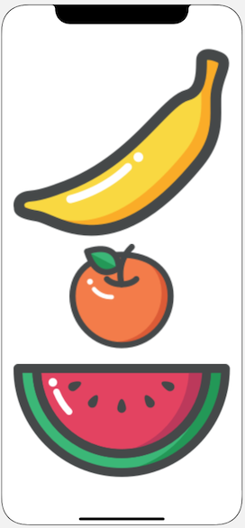
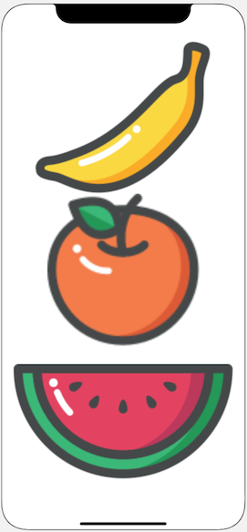
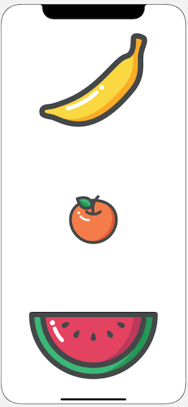

## In Class Activity

You can complete the following practice in a new Xcode project. Using the storyboard, have 2 different view controllers and just change the initial view controller each time to the one you are working on.

### StackView Distribution Types

In an empty ViewController, create a StackView with three views, assign them different colors. The examples will use images of fruits, but you don't need to.

Then practice matching each of the distribution types.

#### Fill

This is the default distribution type.
When you insert elements into a UIStackView with the distribution set to fill, it will keep all but one item at its intrinsic size and stretch it to fill the remaining space.
It determines the view to fill by the Content Hugging Priority (CHP). The view with the **lowest** CHP is stretched to fill the space in the UIStackView.

If all of your view in the UIStackView have the same CHP, Xcode will show an ambiguous layout error.

StackView Control

Banana Content Hugging Priority

Banana has a CHP of 250, Apples and Oranges have 251

#### Fill Equally

Each view in the UIStackView will have the equal size. The CHP does not matter with this type of distribution, because the views are of equal size.

#### Fill Proportionally

This distribution type will try to fill a UIStackView with the intrinsic content size of the elements in the StackView.

With Fill and Fill Equally, the StackView determines how large the elements are, with Fill Proportionally, the size of the elements are determined by the intrinsic size of its elements.

#### Equal Spacing

This distribution type will keep an equal spacing between each of the views but will not resize the views themselves.
It uses the intrinsic size of its views.

- --

#### Equal Centering

This type of distribution will divide the stackview according to the number of elements and place the elements

**Benefits**

- Layout is re-calculated when views are
hidden or added! Try hiding an element in the stack and see what happens.
- Try to build interface with UIStackView, add
explicit constraints only when necessary

## Practice building a Layout

Using the interface builder and a new ViewController, recreate the following design. Take into consideration that since you are going to be using AutoLayout it should look good both in portrait and landscape mode. To change between orientation modes in the simulator app you can rotate right (command + right arrow) and rotate left (command + left arrow).

