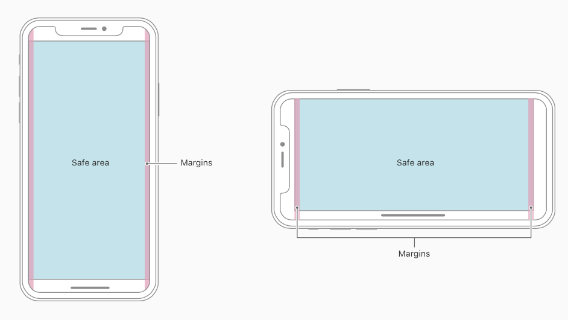
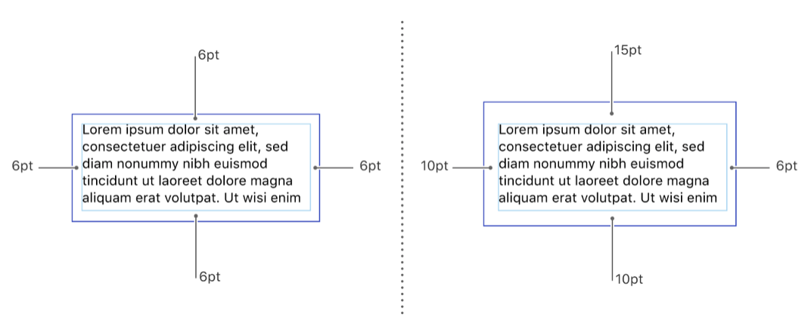
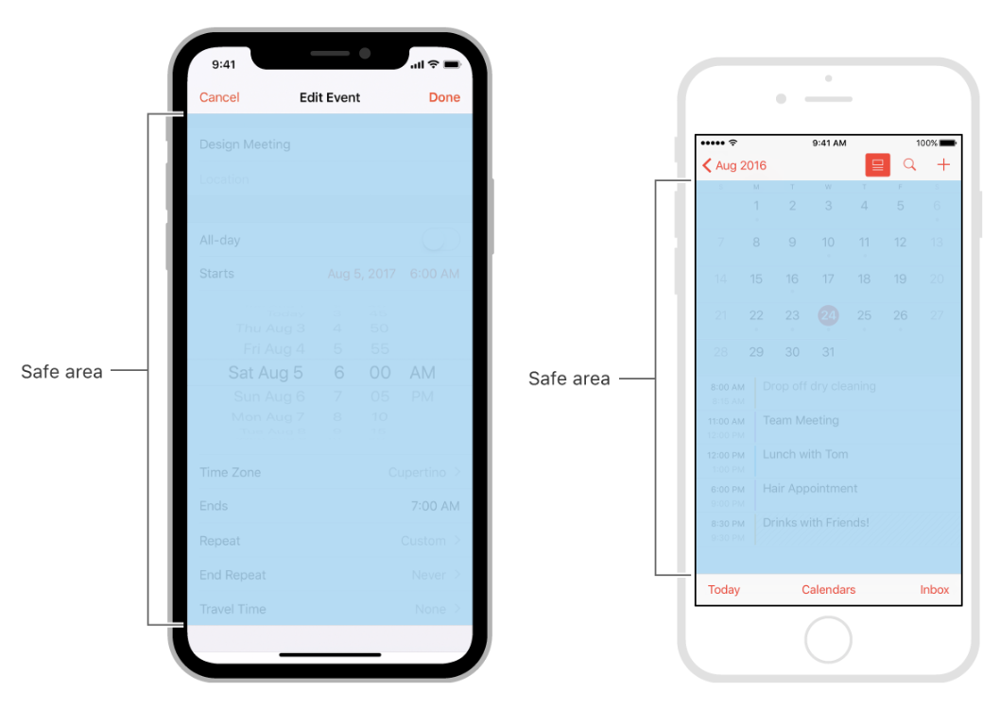
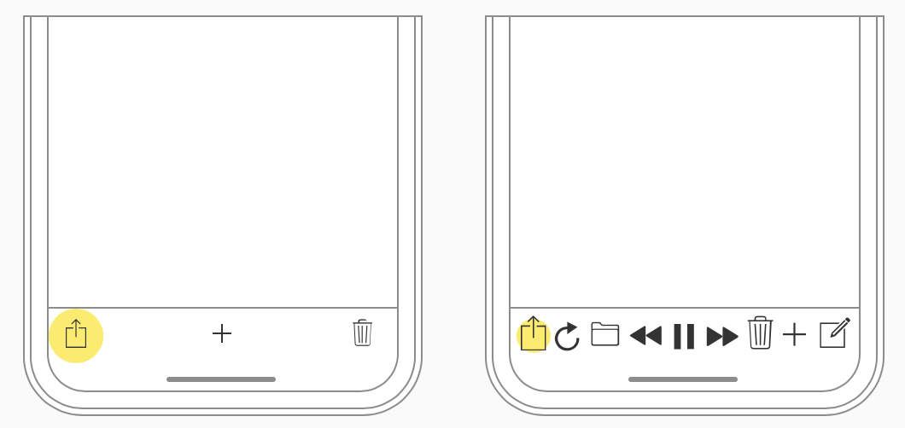
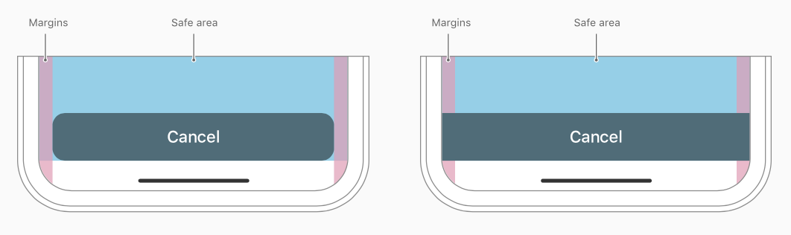
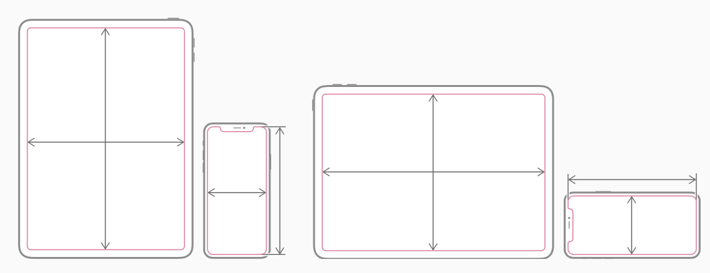

<!-- Run this slideshow via the following command: -->
<!-- reveal-md README.md -w -->

<!-- .slide: class="header" -->
# Autolayout Pt.2

## [Slides](https://make-school-courses.github.io/MOB-1.2-Introduction-to-iOS-Development/Slides/02-Autolayout/README.html ':ignore')

<!-- > -->

## Agenda

- Learning Objectives
- Review
- Layout Guides & Safe Area
- Size Classes
- UIPagerViewController

<!-- > -->

## Learning Objectives

By the end of this lesson, students should be able to:

1.

<!-- > -->

## Review

Pair up to discuss the following:
  - Why do we need AutoLayout? What problems does it solve.
  - Can we layout views without using AutoLayout?
  - Properties of AutoLayout.
  - The most valuable tip you found to debug errors with AutoLayout

<!-- > -->

## Layout Guides & Safe Area

Layout guides define rectangular regions that don’t actually appear visibly onscreen, but help with the positioning, alignment, and spacing of content.

<!-- v -->

### Margins

We use margins to position views so that they are not crowded by other content.

)

The layout margins consist of inset values for each edge (top, bottom, leading, and trailing) of the view. These inset values create a space between the edges of the view’s bounds rectangle and the content inside the view.

<aside class = "notes">
Layout margins provide a space between a view’s content and any content outside of the view’s bounds.
</aside>

<!-- v -->

### Safe Area

We use it to position views so that they are not obstructed by other content.

<aside class="notes">
Adhere to the safe area and layout margins defined by UIKit. The safe area also prevents content from underlapping the status bar, navigation bar, toolbar, and tab bar.
</aside>

<!-- > -->

## Which option do you think is best?

<aside class="notes">
Discuss with a partner.
<aside>

<!-- v -->

## Which option do you think is best?

<aside class="notes">
Discuss with a partner.
<aside>

<!-- > -->

## Size Classes

Are traits that are automatically assigned to content areas based on their size.

The system defines two size classes:
 - **regular** - denotes a bigger space
 - **compact** -  denotes constrained space

<!-- > -->

A view may possess any combination of size classes:

<aside class = "notes">

- Regular width, regular height
- Compact width, compact height
- Regular width, compact height
- Compact width, regular height

Full list of combinations [here](https://developer.apple.com/design/human-interface-guidelines/ios/visual-design/adaptivity-and-layout/)
</aside>

<!-- > -->

## Using Size Classes

- Follow the instructions [here](assignments/sizeclasses.md) to create a layout that works in portrait and landscape orientations.
- If you get stuck feel free to debug with a partner or raise your hand to ask questions.

<!-- v -->

Why do you think we needed to change our initial setup and add more stack views?

<!-- v -->

Why do we care to change the layout in landscape mode, when the original stack view changed by itself and we could still see the 4 colors?

<!-- v -->

Is it always required to use size classes? What is a good criteria to know if we should use them or not?

<!-- > -->

## Additional Resources
- https://developer.apple.com/documentation/uikit/uiview/positioning_content_within_layout_margins
- https://developer.apple.com/documentation/uikit/uiview/positioning_content_relative_to_the_safe_area
- https://developer.apple.com/design/human-interface-guidelines/ios/visual-design/adaptivity-and-layout/
