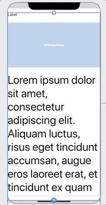

<!-- Run this slideshow via the following command: -->
<!-- reveal-md README.md -w -->

<!-- .slide: class="header" -->
# Autolayout Pt.2

## [Slides](https://make-school-courses.github.io/MOB-1.2-Introduction-to-iOS-Development/Slides/02-Autolayout/README.html ':ignore')

<!-- > -->

## Agenda

- Learning Objectives
- Review
- Layout Guides & Safe Area
- Scroll Views
- Size Classes

<!-- > -->

## Learning Objectives

By the end of this lesson, students should be able to:

1. Identify various layout guide lines in a screen.
1. Implement a scroll view using the interface builder.
1. Know the importance of size classes and start using them in the IB.

<!-- > -->

## Review

Pair up to discuss the following:
  - Why do we need AutoLayout? What problems does it solve.
  - Can we layout views without using AutoLayout?
  - Properties of AutoLayout.
  - The most valuable tip you found to debug errors with AutoLayout

<!-- > -->

## Layout Guides & Safe Area

Layout guides define rectangular regions that don’t actually appear visibly onscreen, but help with the positioning, alignment, and spacing of content.

<!-- v -->

### Margins

We use margins to position views so that they are not crowded by other content.

<aside class = "notes">
The layout margins consist of inset values for each edge (top, bottom, leading, and trailing) of the view. These inset values create a space between the edges of the view’s bounds rectangle and the content inside the view.

Layout margins provide a space between a view’s content and any content outside of the view’s bounds.
</aside>

<!-- v -->

### Safe Area

We use it to position views so that they are not obstructed by other content.

<aside class="notes">
Adhere to the safe area and layout margins defined by UIKit. The safe area also prevents content from underlapping the status bar, navigation bar, toolbar, and tab bar.
</aside>

<!-- > -->

## Which option do you think is best?

<aside class="notes">
Discuss with a partner.
<aside>

<!-- v -->

## Which option do you think is best?

<aside class="notes">
Discuss with a partner.
<aside>

<!-- > -->

## Scroll Views

Sometimes designs need for content to be scrolled because it won't fit in the space of the screen. This is even harder to achieve given iPhones have different screen sizes.

Setting a scroll view can be quite a headache, because there are guidelines, safe areas and content sizes we need to pay attention to.

<aside class = "notes">
Whiteboard explanation of how the scrollview works.
</aside>

<!-- v -->

## Scrollview recipe

1. Pin the top, bottom, trailing and leading of the scroll view to the Safe Area.
1. If the content was a stack view you would pin the the the stack's top, bottom, trailing and leading to the Content Layout Guide.
1. Set the content view's width to match the Frame Layout Guide's width.
1. Look for missing constraints inside the content view.
1. If all is correct, the scroll view will set its content size automatically based on the components inside the content view.

<!-- v -->

## Activity

20 min - Replicate the following layout. 
5 min - Instructor shows solution

<aside class="notes">
You can change the size of the screen you see in the interface builder to be as long as you need to see the elements you are adding to the scroll view. And not having to be restricted to the real screen size.

do this by selecting the view controller with the scroll view, then go to the attributes inspector and choose the ruler icon. Change the simulated size from Fixed to Freeform and make it as large as you need.
</aside>

<!-- > -->

## Size Classes

Are traits that are automatically assigned to content areas based on their size.

The system defines two size classes:
 - **regular** - denotes a bigger space
 - **compact** -  denotes constrained space

<!-- > -->

A view may possess any combination of size classes:

<aside class = "notes">

- Regular width, regular height
- Compact width, compact height
- Regular width, compact height
- Compact width, regular height

Full list of combinations [here](https://developer.apple.com/design/human-interface-guidelines/ios/visual-design/adaptivity-and-layout/)
</aside>

<!-- > -->

## Using Size Classes

- Follow the instructions [here](https://github.com/Make-School-Courses/MOB-1.2-Introduction-to-iOS-Development/blob/master/Lessons/02-AutoLayout/assignments/sizeclasses.md) to create a layout that works in portrait and landscape orientations.
- If you get stuck feel free to debug with a partner or raise your hand to ask questions.

<!-- v -->

Why do you think we needed to change our initial setup and add more stack views?

<!-- v -->

Why do we care to change the layout in landscape mode, when the original stack view changed by itself and we could still see the 4 colors?

<!-- v -->

Is it always required to use size classes? What is a good criteria to know if we should use them or not?

<!-- > -->

## After Class

Install [SwiftLint](https://github.com/realm/SwiftLint) in a project.

For this activity you will need to have [Cocoapods](https://cocoapods.org). If you are not familiar with it. Go to their site to read about what it is and follow the instructions to install it.

<!-- > -->

## Additional Resources
- [Using layout margins](https://developer.apple.com/documentation/uikit/uiview/positioning_content_within_layout_margins)
- [Using the safe area](https://developer.apple.com/documentation/uikit/uiview/positioning_content_relative_to_the_safe_area)
- [Apple Docs on autolayout](https://developer.apple.com/design/human-interface-guidelines/ios/visual-design/adaptivity-and-layout/)
- [A scrollview tutorial](https://www.raywenderlich.com/5758454-uiscrollview-tutorial-getting-started#toc-anchor-007)
- [A very very detailed explanation on how scrollviews work (you don't need to know this level of details, but in case you are curious)](https://www.objc.io/issues/3-views/scroll-view/)
