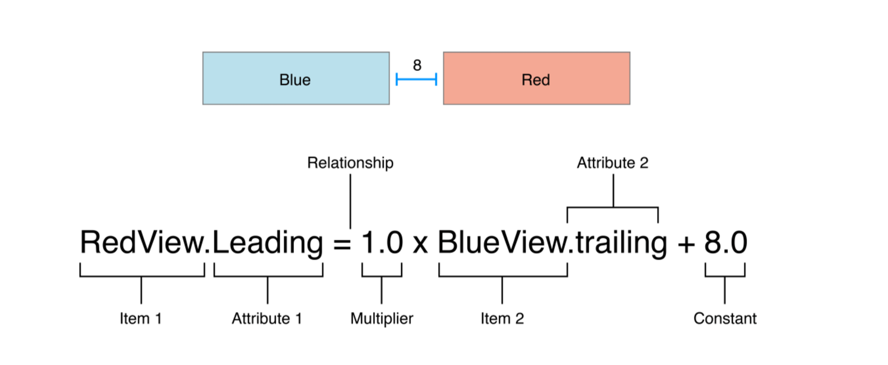

# Introduction to Xcode and Autolayout

## Minute-by-Minute

| **Time(min)** | **Activity**                            |
| ------------- | ----------------------------------------|
| 5             | Review of Last Class & Objectives       |
| 10            | TT Introduction to AutoLayout           |
| 20            | Videos on AutoLayout & answer questions |
| 10            | Break                                   |
| 20            | TT AutoLayout example                   |
| 35            | Work on AutoLayout challenges           |
| 5             | Wrap up                                 |

## Class Learning Objectives

By the end of this lesson, students should be able to:

- Position UI elements using AutoLayout
- Describe AutoLayout's relational properties
- Inspect and use the visual debugging features of Xcode

## Vocabulary

- Constraints
- Frame
- UIView
- Origin
- Child view
- Superview
- Center
- Position(x, y)

## Constraints

## In Class Activity

Watch the videos below and pair up (2's) to discuss the following:
  - Why do we need AutoLayout? What problems does it solve.
  - Can we layout views without using AutoLayout?
  - Properties of AutoLayout.

Introduction to AutoLayout Videos:

[Positioning UIViews Pt.1](https://www.youtube.com/watch?v=t_lmUi_E-70&t=37s) 
[Positioning UIViews Pt.2](https://www.youtube.com/watch?v=3GPnG5jsKS8&feature=youtu.be) 
[Autolayout programmatically Pt.1](https://www.youtube.com/watch?v=PYqaVQlKT0A) 
[Autolayout programmatically Pt.2](https://www.youtube.com/watch?v=qdzjCEl3ATg) 

## Overview

Slides:

[Xcode & AutoLayout](https://docs.google.com/presentation/d/1NPCWrzL29k2xn7b78ANqTy-MsXUliMxWwvSjySxI9jc/edit?usp=sharing)

## In Class Activity

Build the following in interface builder in Xcode

1. Place 2 UIViews in interface builder that each take 50% of the view controllers space.

----------------

2. Place 2 UIViews in interface builder, one takes twice the space of the other, i.e. 2 to 1 ratio.

----------------

3. Place two views side by side equally

---------------

4. Place a UIView and 2 labels

## Additional Resources

[Apple Documentation - AutoLayout](https://developer.apple.com/library/content/documentation/UserExperience/Conceptual/AutolayoutPG/index.html) 
[Tips for Autolayout](https://blog.supereasyapps.com/30-auto-layout-best-practices/) 
[MS Autolayout series Pt.1](https://www.youtube.com/watch?v=MEhDeQurPqg) 
[MS Autolayout series Pt.2](https://www.youtube.com/watch?v=evILiMVw01E) 
[MS Autolayout series Pt.3](https://www.youtube.com/watch?v=lsi68I_DwVQ&t=1082s) 
[MS Autolayout series Pt.4](https://www.youtube.com/watch?v=d-Ukb0MOfy8) 
[MS Autolayout series Pt.5](https://www.youtube.com/watch?v=bunRUPlr83Y) 
[MS Autolayout series Pt.6](https://www.youtube.com/watch?v=38o--ZMWqHc) 
[MS Autolayout series Pt.7](https://www.youtube.com/watch?v=LvRln-abo0U) 
[MS Autolayout series Pt.8](https://www.youtube.com/watch?v=lq19vkSJ03M&t=637s) 
[MS Autolayout series Pt.9](https://www.youtube.com/watch?v=ORLd596Kz2k)
