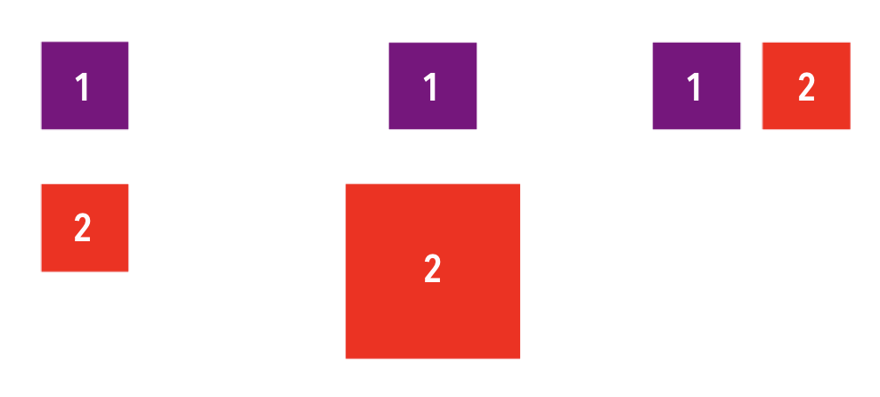

<!-- Run this slideshow via the following command: -->
<!-- reveal-md README.md -w -->

<!-- .slide: class="header" -->
# Coding Constraints

## [Slides](https://make-school-courses.github.io/MOB-1.2-Introduction-to-iOS-Development/Slides/03-CodingConstraints/README.html ':ignore')

<!-- > -->

## Agenda

- Learning Objectives
- Constraints programmatically
- Anchors and Layout Constraints
- Onboarding activity

<!-- > -->

## Learning Objectives

By the end of this lesson, students should be able to:

1. Use the `NSLayoutConstraint` and `NSLayoutAnchor` classes
1. Set up a scroll view using only code
1. Create an onboarding flow with AutoLayout programmatically

<!-- > -->

## Constraints

Layout anchors let us create constraints that are easy to read and in a compact format.

```swift
myView.leadingAnchor.constraint(equalTo: margins.leadingAnchor).isActive = true
```

<!-- v -->


<!-- v -->

Sample view

```swift
import UIKit

class ViewController: UIViewController {

    var exampleView: UIView!

    override func loadView() {
        super.loadView()

        exampleView = UIView(frame: .zero)
        exampleView.translatesAutoresizingMaskIntoConstraints = false
        self.view.addSubview(exampleView)
        NSLayoutConstraint.activate([
            exampleView.widthAnchor.constraint(equalToConstant: 80),
            exampleView.heightAnchor.constraint(equalTo: exampleView.widthAnchor, multiplier: 1/1),
            exampleView.centerXAnchor.constraint(equalTo: self.view.centerXAnchor),
            exampleView.centerYAnchor.constraint(equalTo: self.view.centerYAnchor),
        ])
    }

    override func viewDidLoad() {
        super.viewDidLoad()
        self.exampleView.backgroundColor = .purple
    }
}
```

<aside class = "notes">
In a mini whiteboard, draw the result of the code. What would be the graphical representation?
</aside>

<!-- v -->

In this example we have several common constraints we will need to use at some point.

- Setting a fixed width or height
- Setting an aspect ratio
- Centering horizontally and vertically

<!-- v -->

Another common constraint that is not shown is setting a proportional width/height.

```swift
exampleView.widthAnchor.constraint(equalTo: self.view.widthAnchor, multiplier: 1/2)
```

<!-- > -->

## Rect Zero

If you noticed in the code snippet, we gave the view a frame with a zero rect.

This is just saying that the rectangle will have its origin and size set to zero.

`CGRect(x: 0, y: 0, width: 0, height: 0)`

<!-- > -->

## translatesAutoresizingMaskIntoConstraints

When using AutoLayout we need this property to be set to false.

If you're using the interface builder, this is done for you.

If you are setting constraints programmatically, you need to remember setting this to false or you'll get an error message of conflicting constraints.

If you want to read more on **why** this conflicting error happens, you can find a very clear explanation [here](http://www.thecodedself.com/autoresizing-masks/).

<!-- > -->

## Activating constraints in a group

In the example, we used a method to activate many constraints at once.

```swift
NSLayoutConstraint.activate([
  ...
])
```

<aside class="notes">
"Convenience method that activates each constraint in the contained array, in the same manner as setting active=YES. This is often more efficient than activating each constraint individually." - Apple Docs
</aside>

<!-- > -->

## Activating individually

```swift
exampleView.widthAnchor.constraint(equalToConstant: 80).isActive = true
exampleView.heightAnchor.constraint(equalTo: exampleView.widthAnchor, multiplier: 1/1).isActive = true
exampleView.centerXAnchor.constraint(equalTo: self.view.centerXAnchor).isActive = true
exampleView.centerYAnchor.constraint(equalTo: self.view.centerYAnchor).isActive = true
```

<!-- > -->

## Best Practices

- As much as you can, never calculate frames manually
- Set `translatesAutoresizingMaskIntoConstraints` to false
- Add the view to the hierarchy with `addSubview`
- Activate your constraints

<!-- > -->

## In Class Activity

Using the anchors approach, code the following:

- Square 2 is 50 pts below the square 1
- Square 2 is twice the size of square 1
- Square 2 to the right of square 1



<!-- > -->

## NSLayoutConstraint class


This method explicitly converts the constraint equation into code. Each parameter corresponds to a part of the equation.

<aside class ="notes">
Unlike the approach taken by the layout anchor API, you must specify a value for each parameter, even if it doesn’t affect the layout. The end result is a considerable amount of boilerplate code, which is usually harder to read.
</aside>

<!-- > -->

## Example

Examine how this code works and then place a new view to the right of the exampleView.

```Swift
import UIKit

class ViewController: UIViewController {

    var exampleView: UIView!
    var redView: UIView!

    override func loadView() {
        super.loadView()

        exampleView = UIView()
        exampleView.translatesAutoresizingMaskIntoConstraints = false
        self.view.addSubview(exampleView)

        NSLayoutConstraint (item: exampleView!, attribute: .width, relatedBy: .equal, toItem: nil, attribute: .notAnAttribute, multiplier: 1.0, constant: 80).isActive = true
        NSLayoutConstraint(item: exampleView!, attribute: .leading, relatedBy: .equal, toItem: view, attribute: .leadingMargin, multiplier: 1.0, constant: 20.0).isActive = true
        NSLayoutConstraint(item: exampleView!, attribute: .top, relatedBy: .equal, toItem: view, attribute: .topMargin, multiplier: 1.0, constant: 20.0).isActive = true
        NSLayoutConstraint(item: exampleView!, attribute: .height, relatedBy: .equal, toItem: nil, attribute:.notAnAttribute, multiplier: 1.0, constant:80.0).isActive = true

        redView = UIView()
        redView.translatesAutoresizingMaskIntoConstraints = false
        self.view.addSubview(redView)

        NSLayoutConstraint (item: redView!, attribute: .width, relatedBy: .equal, toItem: nil, attribute: .notAnAttribute, multiplier: 1.0, constant: 80).isActive = true
        NSLayoutConstraint(item: redView!, attribute: .leadingMargin, relatedBy: .equal, toItem: exampleView, attribute: .trailingMargin, multiplier: 1.0, constant: 20.0).isActive = true
        NSLayoutConstraint(item: redView!, attribute: .top, relatedBy: .equal, toItem: view, attribute: .topMargin, multiplier: 1.0, constant: 20.0).isActive = true
        NSLayoutConstraint(item: redView!, attribute: .height, relatedBy: .equal, toItem: nil, attribute:.notAnAttribute, multiplier: 1.0, constant:80.0).isActive = true

        // Place a red view 20 pts apart from the exampleView (to the right).
    }

    override func viewDidLoad() {
        super.viewDidLoad()
        self.exampleView.backgroundColor = .purple
        self.redView.backgroundColor = .red

    }
}

```

<!-- > -->

## In Class Activity

[The Subscription box](https://github.com/Make-School-Courses/MOB-1.2-Introduction-to-iOS-Development/blob/master/Lessons/03-CodingConstraints/assignments/onboarding.md)


<!-- > -->

## After Class or Stretch Challenge

Look up constraints with visual format. It's another way to add constraints to views. We won't cover it since it's very verbose and not really necessary, but you might see them in the wild, or when working in an old project.

Repeat the first in class activity using the visual format language.

<!-- > -->

## Additional Resources

Free Illustrations
- [unDraw](https://undraw.co/illustrations)
- [drawKit](https://www.drawkit.io)
- [Mobile Design Patterns](https://mobbin.design)
- [Common constraints](https://theswiftdev.com/2018/06/14/mastering-ios-auto-layout-anchors-programmatically-from-swift/)
- [Programmatically creating constraints - Apple Docs](https://developer.apple.com/library/archive/documentation/UserExperience/Conceptual/AutolayoutPG/ProgrammaticallyCreatingConstraints.html)
- [NSLayoutConstraint Class](https://developer.apple.com/documentation/appkit/nslayoutconstraint/1526954-init)
