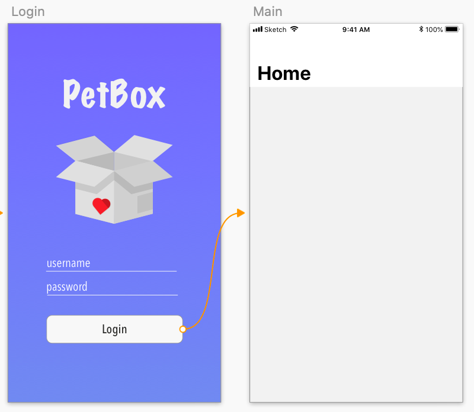

builder<!-- Run this slideshow via the following command: -->
<!-- reveal-md README.md -w -->

<!-- .slide: class="header" -->
# Model View Controller

## [Slides](https://make-school-courses.github.io/MOB-1.2-Introduction-to-iOS-Development/Slides/05-Intro-to-MVC/README.html ':ignore')

<!-- > -->

## Agenda

- MVC
- Organizing our project
- Segues review
- Navigation programmatically
- Working without a storyboard
- Extending our project

<!-- > -->

## Learning Objectives

By the end of this lesson, students should be able to:

- Describe and use MVC in an Xcode project
- Implement segues for navigation
- Implement navigation programmatically
- Send information between view controllers using segues and programmatically

<!-- > -->

## Architectural Patterns

Eventually we get to a point where our projects start to get bigger: more swift files, xib files, assets, etc.

If we are not careful we'll en up with spaghetti code: **without structure, difficult to follow and very hard to maintain.**

We can avoid this by an architectural pattern.

**"An architectural pattern is a general, reusable solution to a commonly occurring problem in software architecture within a given context"**

<!-- > -->

## MVC

MVC is Apple's recommended architecture for iOS apps.

It's made up of three main objects:
- **The Model:** Where your data lives.
- **The View*:** What the user sees.
- **The Controller:** Mediator between the view and the model.

<!-- v -->


<!-- > -->

## The model

- Persistence
- Model objects
- Parsers
- Managers
- Networking
- Helpers
- Extensions

<!-- > -->

## The view

Often reusable and doesn't handle any business logic.

- UIView subclasses
- Animations

How to know if we are doing views right?

Does it interact with the model layer?<br>
Does it contain any business logic?<br>
Does it try to do anything not related to UI?<br>

<aside class="notes">
All of these questions normally should be a no, otherwise the view is already doing more than needed. This is a standard check but not necessarily must be true 100% of times.
</aside>

<!-- > -->

## The controller

The least reusable part of an app 😰

What are its responsibilities? It's basically the 🧠 of the app.

- Order of method calls.
- Refreshing the app.
- Presenting new views.
- Sending object between views.
- Handle user interaction (What happens after the user taps a button?)

<!-- > -->

## In Class Activity

1. From what you just learned, draw your own version of the MVC diagram and review the responsibilities for each component.

2. Explain your diagram to someone else and make sure you both have a good understanding of the concepts. Ask the instructor if there is a common doubt.

<!-- > -->

## In Class Activity

Now that you know better about the different components, take your subscription box project and arrange your files to land on three different groups: Model, View, Controller.

1. Right click on the project navigator -> New Group (x3)
2. Move files accordingly
3. Compare your new structure with a classmate, discuss your decisions.

<!-- > -->

## Navigation

So far we've been building apps with one screen. Most of the time you will need to interact between more than 2 screens in your apps. Think about how just an onboarding screen and your main content are already 2 screens in the whole project. Screen transitions can be done both programmatically, using segues, or with a combination of both.

<!-- > -->

### Segues (recap MOB 1.1)

A transition between two view controllers in your app’s storyboard file.

The starting point of a segue is the button, table row, or gesture recognizer that initiates the segue. The end point of a segue is the view controller you want to display.

<!-- v -->


<aside class="notes">
At runtime, UIKit loads the segues associated with a view controller and connects them to the corresponding elements. When the user interacts with the element, UIKit loads the destination view controller, notifies your app that the segue is about to occur, and executes the transition.
</aside>

<!-- > -->

### How to

**Step 1:** To create a segue between view controllers in the same storyboard file, Control-click element handling the user interaction in the first view controller and drag to the destination view controller.

**Step 2:** The Interface Builder then prompts you to select the type of relationship you want to create between the two view controllers.

<!-- > -->

## Unwind segue

A way to navigate back in the stack of view controllers.

To review more on this topic and see the programmatic approach for segues, revisit the **[Basic Navigation](https://make-school-courses.github.io/MOB-1.1-Introduction-to-Swift/#/Lessons/12-Basic-Navigation/README)** lesson from MOB 1.1.

<!-- > -->

## In Class Activity

Complete the [Segue Challenge](https://github.com/amelinagzz/segue-starter)

<!-- > -->

## Navigation Programmatically

Steps to setup a project with a navigation controller without a Storyboard.

1. First we need to delete the storyboard file.
2. Then remove the storyboard name on Project Navigator > Select Project > General > Deployment Info > Main Interface
3. Remove the Storyboard name from the .plist (you can command+F "main")
3. Now we need to change the SceneDelegate to tell our app what to use as the initial ViewController.

<!-- > -->

```swift
func scene(_ scene: UIScene, willConnectTo session: UISceneSession, options connectionOptions: UIScene.ConnectionOptions) {
        guard let windowScene = (scene as? UIWindowScene) else { return }
        window = UIWindow(frame: UIScreen.main.bounds)
        let viewController = //An instance of your view controller goes here
        window?.rootViewController = viewController
        window?.makeKeyAndVisible()
        window?.windowScene = windowScene
    }
```
<aside class="notes">
Programmatically we defined an instance of the view controller and set it as the root view controller of the main window.
</aside>

<!-- > -->

Changing the `rootViewController` from another View Controller:

```swift
self.view.window!.rootViewController = //Instance of the VC you want to go to
```
<!-- > -->

### Presenting a VC with the sliding left animation

```swift
let nextVC = ViewController()
self.navigationController?.pushViewController(nextVC, animated: true)
```

(In case you still have storyboard)

```swift
let mainStoryboard = UIStoryboard(name: "Main", bundle: nil)
guard let nextVC = mainStoryboard.instantiateViewController(withIdentifier: "nextVC") as? ViewController else {
  return print("storyboard not set up correctly, check the identity of \"nextVC\"")
}

present(nextVC, animated: true, completion: nil)
```

<!-- > -->

### Dismissing a View Controller to go back to a previous screen

If you used the present method:

```swift
self.dismiss(animated: true, completion: nil)
```

If you used the push method:

```swift
self.navigationController?.popViewController(animated: true)
```

Return to root:
```swift
self.navigationController?.popToRootViewController(animated: true)
```

<!-- > -->

## Creating a Navigation Controller

When using the storyboard, we would embed view controllers in navigation controllers in the interface builder.

We can also do it programmatically:

```swift
let navigationController = UINavigationController(rootViewController: //some VC)
self.view.window!.rootViewController = navigationController //you can set it as root

//or

present(navigationController, animated: true, completion: nil) present it on top of an existing VC

```

Having a navigation controller gives us a navigation bar and the stack to show and dismiss view controllers.

## Passing Information

Sending values over to a new view controller looks very similar to how we did it with segues.

The difference is that we assign the value of properties right after creating the instance of the second view controller.

```swift
let nextVC = ViewController()
nextVC.color = UIColor.red //The instance of ViewController has a property called `color` and we are sending over the value `UIColor.red` to use it later in the next VC.
```

<!-- > -->

## In Class Activity

Using your project:
  - Delete the storyboard.
  - Create a new VC file that will serve as the home of the app (where the main content is).
  - Create a new VC file that will serve as a Login screen. For now, this screen will only have a button to continue to the home screen. Add constraints to the button using the anchor approach.
  - Modify the AppDelegate to start with the Onboarding flow.
  - Have the onboarding flow direct you to the Login screen. Use the method to change the rootViewController here.
  - From the login navigate to the home screen of the app. Make sure the Home screen is embedded in a navigation controller. So that we can show new view controllers and dismiss them as we need.

<!-- > -->


<!-- > -->

## After Class/Lab

1. Redesign your Login screen to include fields for user and password.
1. Practice sending data over by displaying the username in the main view.
1. Create three buttons in the main view with the following options (we'll use them in upcoming classes): New Box, Past Boxes, Profile.

<!-- > -->




<!-- > -->

### Changing rootViewController with an animation (cool thing to know)

Scenarios: <br>
The end of an onboarding flow.<br>
User logged out.


```swift
extension UINavigationController {
    /**
     It removes all view controllers from navigation controller then set the new root view controller and it pops.

     - parameter vc: root view controller to set a new
     */
    func initRootViewController(vc: UIViewController, transitionType type: String = "kCATransitionFade", duration: CFTimeInterval = 0.3) {
        self.addTransition(transitionType: type, duration: duration)
        self.viewControllers.removeAll()
        self.pushViewController(vc, animated: false)
        self.popToRootViewController(animated: false)
    }

    /**
     It adds the animation of navigation flow.

     - parameter type: kCATransitionType, it means style of animation
     - parameter duration: CFTimeInterval, duration of animation
     */
    private func addTransition(transitionType type: String = "kCATransitionFade", duration: CFTimeInterval = 0.3) {
        let transition = CATransition()
        transition.duration = duration
        transition.timingFunction = CAMediaTimingFunction(name: CAMediaTimingFunctionName.easeInEaseOut)
        transition.type = CATransitionType(rawValue: type)
        self.view.layer.add(transition, forKey: nil)
    }
}
```

<!-- > -->

## Additional Resources

[Apple Documentation on MVC](https://developer.apple.com/library/content/documentation/General/Conceptual/DevPedia-CocoaCore/MVC.html)<br>
[MVC analogy](https://medium.freecodecamp.org/model-view-controller-mvc-explained-through-ordering-drinks-at-the-bar-efcba6255053)<br>
[More on MVC](https://codeburst.io/mvc-design-pattern-analogy-to-an-old-school-landline-3dcd2e994063)<br>
[Wikipedia - architectural pattern](https://en.wikipedia.org/wiki/Architectural_pattern)
[MVC tutorial with networking](https://www.raywenderlich.com/1000705-model-view-controller-mvc-in-ios-a-modern-approach)
[Manual Navigation - article](https://medium.com/whoknows-swift/swift-the-hierarchy-of-uinavigationcontroller-programmatically-91631990f495)
