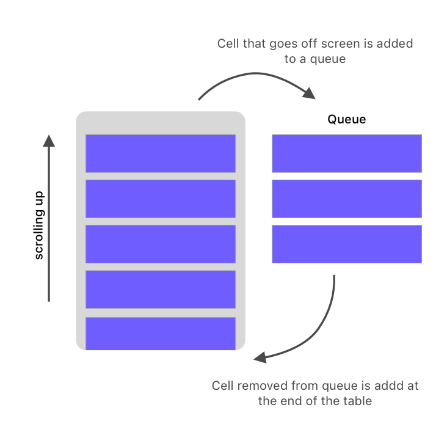
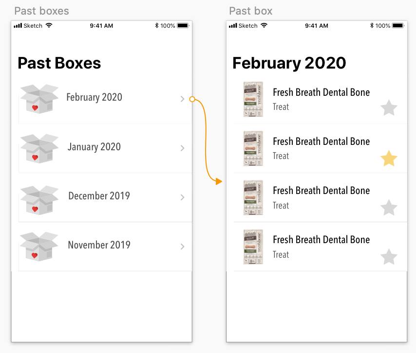

<!-- Run this slideshow via the following command: -->
<!-- reveal-md README.md -w -->

<!-- .slide: class="header" -->
# Table Views

## [Slides](https://make-school-courses.github.io/MOB-1.2-Introduction-to-iOS-Development/Slides/06-TableViews/README.html ':ignore')

<!-- > -->

## Agenda

- What is UITableView?
- How are cells created?
- Extensions & Performance
- Creating tables in the storyboard
- Using custom cells
- Extending the subscription box app

<!-- > -->

## Learning Objectives
By the end of this lesson, students should be able to:

- Setup and display a list of data in a UITableView
- Identify the components of a UITableView (datasource & delegate)
- Select elements in a UITableView
- Use extensions to structure code

<!-- > -->

### UITableView

A view that presents data (a list of items) using **rows** arranged in a **single column**.

`UITableView` is a subclass of `UIScrollView`, this allows users to scroll through the elements in the table in vertical direction.

<!-- v -->


<!-- > -->

### Cells

Each individual item of the table is a `UITableViewCell` object. A cell object has various parts but most of it is reserved for its content: text, image, or any other kind of distinctive identifier.


<!-- v -->

### How is a cell created?

Let's say we need a table with 1000 rows. We use the the following method `cellForRowAtindexPath` to generate cells.

```swift
func tableView(_ tableView: UITableView, cellForRowAt indexPath: IndexPath) -> UITableViewCell {
   let cell = UITableViewCell()
   cell.textLabel?.text = "Cell with index: \(indexPath.row)"
   return cell
}
```

Every time the method gets called we are creating a new instance of a `UITableViewCell`. If these cells had text and images, loading 1000 of them and allocating memory as we scroll, will make the app very laggy. 😰

<!-- v -->

To solve this problem we can reuse cells with the `dequeueReusableCell(withIdentifier:for:)` method. For this we will need a reuse identifier.

```swift
func tableView(_ tableView: UITableView, cellForRowAt indexPath: IndexPath) -> UITableViewCell {
    let cell = tableView.dequeueReusableCell(withIdentifier: "UITableViewCell", for: indexPath)
    cell.textLabel?.text = "Cell with index: \(indexPath.row)"
    return cell
}
```

<!-- v -->

### How does it work?



<aside class="notes">

There's no need to create 1000 cells but instead create enough to cover the area of the table view.

At runtime, the table view stores cell objects in an internal queue. When the table view asks the data source to configure a cell object for display (when we scroll the table), the data source can access the queued object by sending a `dequeueReusableCellWithIdentifier:` message to the table view, passing in a reuse identifier. Then the data source sets the content of the cell before returning it. This reuse of cell objects is a performance enhancement because it eliminates the overhead of cell creation that can cause a shortage in memory.
</aside>

<!-- > -->

### Sections & Rows


<aside class="notes">
A table view is made up of sections, each with its own rows. Sections are identified by their index number within the table view, and rows are identified by their index number within a section.

Sections have headers that appear at the top of each group and include a title. The footer appears below each group and also has a title. The entire table can also have its own header and footer.
</aside>

<!-- v -->

## Try this

1. Open your contacts app. Notice how the component to display the contacts is a table.
1. Can you tell how many sections its has?
1. How many total rows?

[UITableView in Apple Docs](https://developer.apple.com/documentation/uikit/uitableview)

<!-- > -->

### DataSource

A `UITableView` object must have an object that acts as a **data source** and an object that acts as a **delegate**.  

The data source must adopt the `UITableViewDataSource` protocol and provides information needed to construct tables and manages the data model when rows of a table are inserted, deleted, or reordered. It manages **how many sections** the table has, **how many rows per section** and handles **how cells are created**.

<!-- v -->

```swift
// How many sections the table has. Default is 1 if not implemented.
optional public func numberOfSections(in tableView: UITableView) -> Int

// How many rows are there per section.
public func tableView(_ tableView: UITableView, numberOfRowsInSection section: Int) -> Int

// If using headers or footers. These use a fixed view, to do something different you need a custom view.
optional public func tableView(_ tableView: UITableView, titleForHeaderInSection section: Int) -> String?
optional public func tableView(_ tableView: UITableView, titleForFooterInSection section: Int) -> String?

//Displays rows, preferably reusing cells.
public func tableView(_ tableView: UITableView, cellForRowAt indexPath: IndexPath) -> UITableViewCell
```

<!-- > -->

### Delegate

The delegate must adopt the `UITableViewDelegate protocol`. Manages table row configuration and **selection, row reordering, highlighting, accessory views, and editing operations**. It deals with how the table behaves and looks.

<!-- v -->

```swift
// When selecting a cell
optional public func tableView(_ tableView: UITableView, didSelectRowAt indexPath: IndexPath)

// When deselecting a cell
optional public func tableView(_ tableView: UITableView, didDeselectRowAt indexPath: IndexPath)

// Changing the default header with a custom view
optional public func tableView(_ tableView: UITableView, viewForHeaderInSection section: Int) -> UIView?

// Defining the height of the rows (different cells can have different heights)
optional public func tableView(_ tableView: UITableView, heightForRowAt indexPath: IndexPath) -> CGFloat
```

<!-- > -->

## IndexPath

Many methods of `UITableView` take `NSIndexPath` objects as parameters and return values. They have properties we can access to manipulate objects in the table.

```swift
var section: Int
```
An index number identifying a section in a table view.
```swift
var row: Int
```
An index number identifying a row in a section of a table view.

<!-- > -->

### Extensions

You decide how to structure you code. When using UITableViews some people prefer to include both protocol implementations inside an extension. This helps a lot with **code readability**.

You can read more about this approach and other use cases for extensions [here](https://cocoacasts.com/four-clever-uses-of-swift-extensions).

<!-- > -->

### Performance

Here are some suggestions to ensure you are using `UITableView` the best way possible without affecting its performance:

- Reuse cells.
- Cache downloaded images.
- If you are using different cell heights, be careful on how often the calculations are made.
- If you can, make your views opaque, transparent objects make the system work much harder.
- Avoid gradients (same idea as transparent objects).

<!-- > -->

## TableViews Three Ways 🎈🌳👽

- [TableView + Storyboard](https://github.com/Make-School-Courses/MOB-1.2-Introduction-to-iOS-Development/blob/master/Lessons/06-TableViews/assignments/tableStoryboard.md)
- [TableView + xib file](https://github.com/Make-School-Courses/MOB-1.2-Introduction-to-iOS-Development/blob/master/Lessons/06-TableViews/assignments/tableXib.md)
- [TableView programmatically](https://github.com/Make-School-Courses/MOB-1.2-Introduction-to-iOS-Development/blob/master/Lessons/06-TableViews/assignments/tableCode.md)

<!-- > -->

## Use a method from the delegate

```swift
func tableView(_ tableView: UITableView, didSelectRowAt indexPath: IndexPath) {
    let alertController = UIAlertController(title: "Hello", message: "You've tapped in the \(indexPath.row) row, from section \(indexPath.section)", preferredStyle: .alert)
    let okAction = UIAlertAction(title: "OK", style: UIAlertAction.Style.default) {
            UIAlertAction in
    }
    alertController.addAction(okAction)
    self.present(alertController, animated: true, completion: nil)
}
```

## Checkpoint

In pairs, answer the following questions?

1. What is `UITableViewDataSource`? Mention some methods it's responsible for.
1. What is `UITableViewDelegate`? Mention some methods it's responsible for.
1. How are cells created?
1. Why do we reuse cells?
1. Mention a technique you can use to improve performance when using tables.
1. Can we use custom classes instead of `UITableViewCell`?

<!-- > -->

## In Class Activity

To our subscription box app:

- Add a screen where users can see previous boxes they've received.
- When they tap on one of the boxes they will see the contents for that month.

You can use dummy data until now.

<!-- v -->

### Stretch challenge

- Users can rate previous items received (just functionality, we don't care about persisting this data)
- Include a description in the item's cell and use a self sizing cell to show the entire text. [Self Sizing cell documentation](https://developer.apple.com/documentation/uikit/uifont/creating_self-sizing_table_view_cells)

<!-- v -->




<!-- > -->

## After Class + Lab

- We've worked all the way until now using dummy data. Now is time to use Models to represent the objects in our app. Remember MVC and where these files need to live.

Here is an example, tailor it to your own app:

```swift

```

<!-- > -->

## Additional Resources

[UITableView in Apple Docs](https://developer.apple.com/documentation/uikit/uitableview)<br>
[Why use reusable cells?](https://medium.com/ios-seminar/why-we-use-dequeuereusablecellwithidentifier-ce7fd97cde8e)<br>
[Improving performance](https://medium.com/capital-one-tech/smooth-scrolling-in-uitableview-and-uicollectionview-a012045d77f)<br>
[Performance tricks](https://www.smashingmagazine.com/2019/02/ios-performance-tricks-apps/)<br>
[Apple docs - how to add headers & footers](https://developer.apple.com/documentation/uikit/views_and_controls/table_views/adding_headers_and_footers_to_table_sections)
