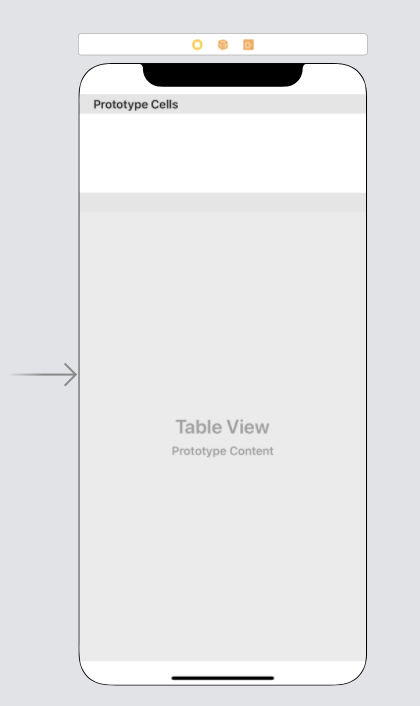
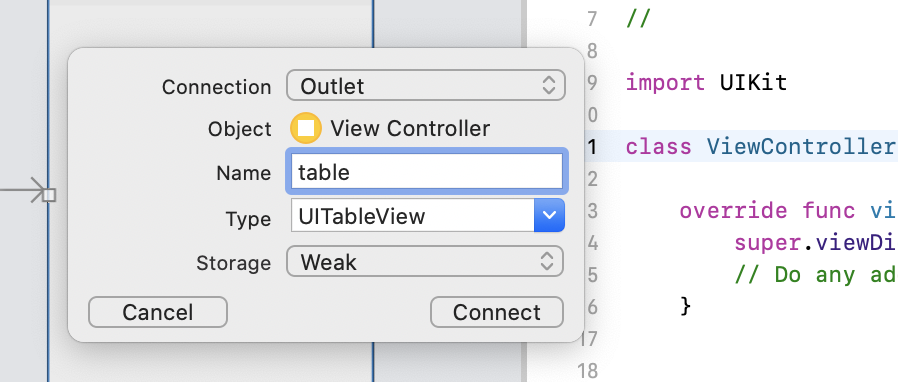
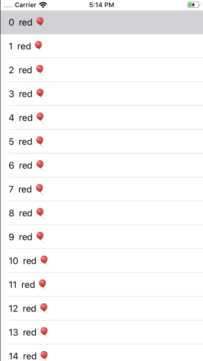

## Creating a UITableView with the storyboard 🎈

## Adding the table

1. Open the storyboard file.
2. Drag a Table View from the object library.
3. Pin it to the edges of the screen.

## Adding a cell

4. Drag a Table View Cell from the object library to the inside of the table.

You should have something like this:



5. Change the identifier of the cell in the attributes inspector. Change it to "BaloonCell" (you'll see why later)


## Connecting the UI

6. Create an IBOutlet for the table in ViewController.swift



## Setting the data source and delegate

7. Add the following inside your viewDidLoad method.

```swift
table.delegate = self
table.dataSource = self
```

8. Tell your class to conform to the table's protocols. Now it looks something like this.

```swift
class ViewController: UIViewController, UITableViewDelegate, UITableViewDataSource {

    @IBOutlet weak var table: UITableView!
    override func viewDidLoad() {
        super.viewDidLoad()
        table.delegate = self
        table.dataSource = self
    }
}
```

When you are done, Xcode will tell you that you are missing some methods. Don't worry about that error, we'll include them next.

## DataSource Methods

9. Add the following array declaration as a global constant in your ViewController class, we'll use it to populate our table.

```swift
let balloonArray = [String](repeating: "red 🎈", count: 100)
```

10. Add the following methods from the data source protocol.

```swift
func tableView(_ tableView: UITableView, numberOfRowsInSection section: Int) -> Int {

}
func tableView(_ tableView: UITableView, cellForRowAt indexPath: IndexPath) -> UITableViewCell {

}
```

11. In the `numberOfRowsInSection` return the count of the `balloonArray`. That's how many rows we want in the table.

```swift
return balloonArray.count
```

12. In the `cellForRowAt` use the `dequeueReusableCell initializer` to have reusable cells.

```swift
let cell = tableView.dequeueReusableCell(withIdentifier: "BaloonCell", for: indexPath)
cell.textLabel?.text = "\(indexPath.row) \(balloonArray[indexPath.row])"
```

The first line is telling the app to use the cell with the identifier we set up before, that's how it knows what cell to reuse.

The second line is setting the text of the cell using the default label. We include the number of the row plus  the contents of the array, using the row as index.

13. Run the app. You should now have 100 rows and you should be able to scroll to the last row and find 99 red balloons.


