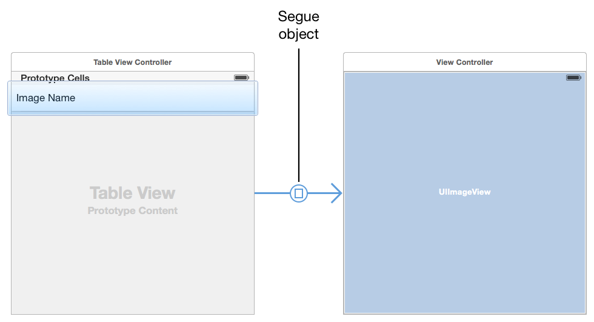
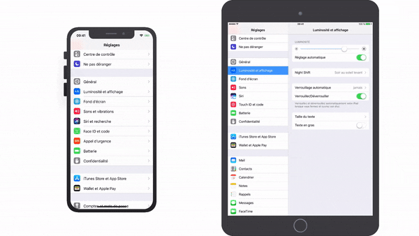

# Passing information between ViewControllers

## Minute-by-Minute
| **Time(min)** | **Activity**                            |
| ------------- | ----------------------------------------|
| 5             | Review of Last Class & Objectives       |
| 10            | TT Segues                               |
| 20            | Segues Demo                             |
| 10            | Break                                   |
| 50            | Mood Tracker Pt. 2                      |
| 5             | Wrap up                                 |

## Class Learning Objectives/Competencies
By the end of this lesson, students should be able to:

- Identify and describe a segue.
- Navigate between view ViewControllers using segues.
- Setup and use a segue to pass information to a destination ViewController.
- Pass information back to a ViewController with an unwind segue.
- Manually perform a segue vs inducing through storyboard.

### How to navigate between view ViewControllers

So far we've been building apps with one screen. Most of the time you will need to interact between more than 2 screens in your apps. Think about how just a login screen and your main content are already 2 screens from the whole project. Screen transitions can be done both programmatically, using segues, or with a combination of both.

### Segues

*In real life:* Move or shift from one role, state, or condition to another without interruption.

*In iOS:*  A transition between two view controllers in your app’s storyboard file. Segues are the building blocks of iOS navigation.

The starting point of a segue is the button, table row, or gesture recognizer that initiates the segue. The end point of a segue is the view controller you want to display.

At runtime, UIKit loads the segues associated with a view controller and connects them to the corresponding elements. When the user interacts with the element, UIKit loads the destination view controller, notifies your app that the segue is about to occur, and executes the transition.



### How to

**Step 1:** To create a segue between view controllers in the same storyboard file, Control-click element handling the user interaction in the first view controller and drag to the destination view controller.


**Step 2:** The Interface Builder then prompts you to select the type of relationship you want to create between the two view controllers.

| **Option**          | **Description**                            |
| -------------       | -------------------------------------------|
| Show (push)         | Allows you to navigate through a stack of view controllers, on top of each other. It pushes the destination view controller, from right to left on the stack.   |
| Show detail         | Used when you are working with split view controllers.|
| Present modally     | Shows View controllers with animations.    |
| Present as popover  | The view controller appears in a popover.  |
| Custom              | You may implement your own custom segue and have control over the behavior.    |

### Show


### Show detail


### Present modally


### Present as popover


**Step 3:** After creating a segue, select the segue object and assign an identifier to it using the attributes inspector. During a segue, you can use it to determine which segue was triggered, which is especially useful if your view controller supports multiple segues.

### How to pass information between view ViewControllers

Here's what happens when a segue is triggered. Most of the work happens in the presenting view controller. The configuration of the new view controller follows the same process as when you create the view controller yourself and present it. Because segues are configured from storyboards, both view controllers involved in the segue must be in the same storyboard.


There are 2 methods in the current view controller that give you opportunities to affect the outcome of the segue.

The `shouldPerformSegueWithIdentifier:sender:` method gives you an opportunity to prevent a segue from happening. Returning NO from this method causes the segue to fail quietly but does not prevent other actions from happening.

The `prepareForSegue:sender:` method of the source view controller lets you pass data from the source view controller to the destination view controller.


### Unwind segue

Unwind segues let you dismiss view controllers. You create unwind segues in Interface Builder by linking a button or other suitable object to the Exit object of the current view controller. When the user taps the button or interacts with the appropriate object, UIKit dismisses the current view controller and any intermediate view controllers to reveal the target of the unwind segue.

### How to

**Step 1:** Choose the view controller that should appear onscreen at the end of an unwind segue.

**Step 2:** Define an unwind action method on the view controller you chose. `@IBAction func myUnwindAction(unwindSegue: UIStoryboardSegue)`

**Step 3:** Navigate to the view controller that initiates the unwind action and control-click the button (or other object) that should initiate the unwind segue. This element should be in the view controller you want to dismiss.

**Step 4:** Drag to the Exit object at the top of the view controller.


**Step 5:** Select your unwind action method from the relationship panel.

NOTE: You must define an unwind action method in one of your view controllers **before** trying to create the corresponding unwind segue in Interface Builder. The presence of that method is required and tells Interface Builder that there is a valid target for the unwind segue.

Example

```swift

 @IBAction func myUnwindAction(_ sender: UIStoryboardSegue){
        if sender.source is NextViewController{
            if let senderVC = sender.source as? NextViewController{
                //Sending back a property from the pevious View Controller
                print(senderVC.receivedText)
            }
        }
    }
```

### Programmatic Segues

```swift
@IBAction func nextVC(_ sender: UIBarButtonItem) {
        performSegue(withIdentifier: "nextVC", sender: nil)
    }
```

## In Class Activities

Complete the [Segue Challenge](https://github.com/amelinagzz/segue-starter)

Continue working on the Mood Tracker app with

[part 2.1](https://github.com/Product-College-Labs/mood-tracker/blob/master/content/6.1-content.md)

[part 2.2](https://github.com/Product-College-Labs/mood-tracker/blob/master/content/6.2-content.md)

[part 2.3](https://github.com/Product-College-Labs/mood-tracker/blob/master/content/6.3-content.md)


## Wrap Up

Complete [this project](https://www.hackingwithswift.com/read/19/1/setting-up) using MapKit (we will use it next class)

Start [Habitual tutorial](https://www.makeschool.com/academy/track/habitual-tutorial---swift-4)

## Additional Resources

[Tutorial with custom transition](https://medium.com/@samstone/create-custom-uinavigationcontroller-transitions-in-ios-1acd6a0b6d25)<br>
Custom transitions library [Hero](https://github.com/HeroTransitions/Hero)<br>
Segues - [Apple Docs](https://developer.apple.com/library/archive/featuredarticles/ViewControllerPGforiPhoneOS/UsingSegues.html)
