# Compositional Layouts

<!-- > -->

## Learning Objectives

By the end of this lesson, students should be able to:

- Understand the different elements of the new layout
- Implement Compositional Layouts using different sections

<!-- > -->

## Why?

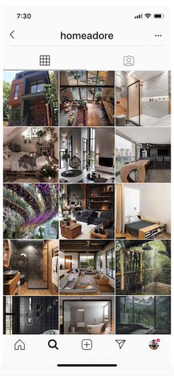

<!-- v -->

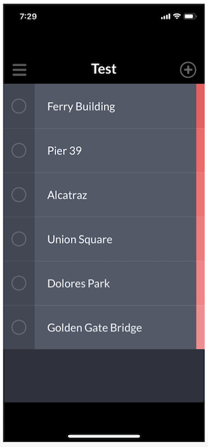

<!-- v -->

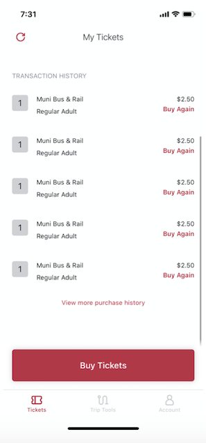

<!-- v -->


<!-- v -->

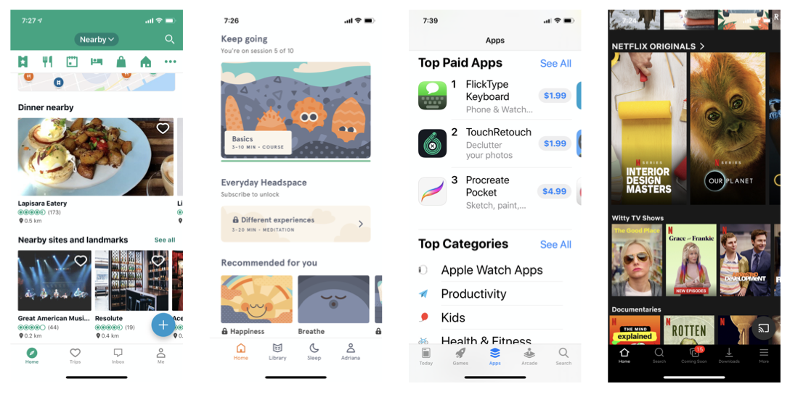

<!-- v -->

When we need to create more complex layouts, we find ourselves in a situation where we need to play with combinations of table views and collection views. This is doable but definitely increases the level of complexity for the developer.

In June 2019, Apple gave us an update for collection views called **compositional layout**. With this new API is easier than ever to create any layout you might need.

<!-- > -->

## Exploring the project

1. Download this [starter project](https://github.com/amelinagzz/CompositionalLayout)
2. Run it, you should see something like this:

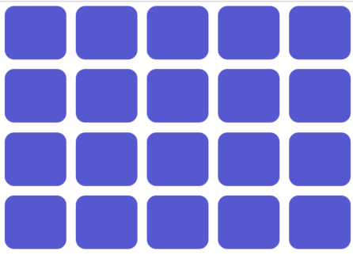

<!-- v -->

3. Go to `BasicGridSection.swift` and find the `itemSize` constant.
4. Change `.fractionWidth(0.2)` to `.fractionalWidth(0.5)`
5. Run it again. What do you get now?

<!-- v -->

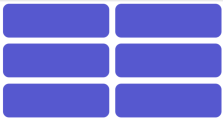

<!-- v -->

6. Go back to where you changed the `itemSize` and now  update `.fractionWidth(0.5)` to `.fractionalWidth(1.0)`
7. Now find the `groupSize` constant and change `.fractionalHeight(0.1)` to `.fractionalHeight(0.25)`
8. Run it again. What do you get now?

<!-- v -->


<!-- v -->

9. Find the `group` and `section` constants.
10. Update the axis to be vertical.
11. After the section declaration add

```swift
section.orthogonalScrollingBehavior = .continuous
```
12. Run it again. What do you get now?

<!-- v -->

## A Challenge

From this point, see if you can get 4 rows of items scrolling horizontally.

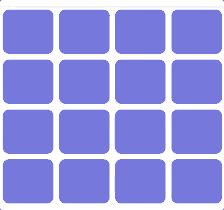

<!-- > -->

## Compositional Layout

Needs 3 elements:

- `NSCollectionLayoutItem` - a single element inside a group
- `NSCollectionLayoutGroup`-  a single group within a section
- `NSCollectionLayoutSection` - all groups combined

<!-- > -->

## Example

A grid that scrolls horizontally

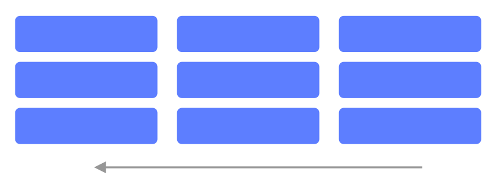

<!-- v -->

## Item

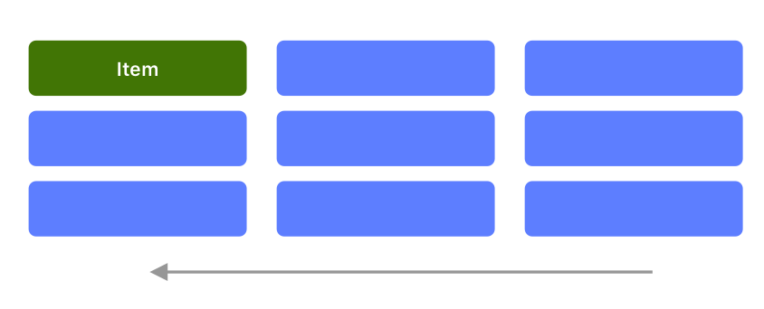

<!-- v -->

## Group

A group with 3 items. Axis: vertical.

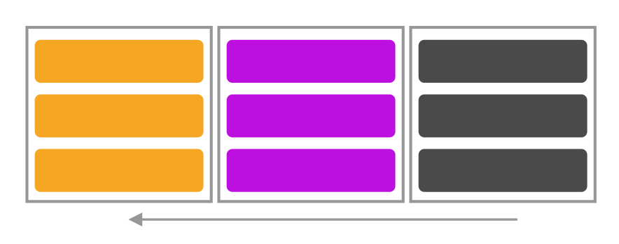

<!-- > -->

## Section

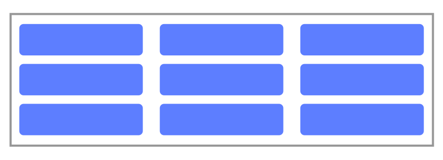


<!-- > -->

## NSCollectionLayoutSize

Used to determine the size of an Item or a Group.

- Fractional width: a fraction of its parent’s full width.
- Fractional height: a fraction of its parent’s full height.
- Absolute: a specific value for the size.
- Estimate: a specific a value but the value can grow or shrink.

<!-- v -->

```swift
let itemSize = NSCollectionLayoutSize(widthDimension: .fractionalWidth(1), heightDimension: .fractionalHeight(1))
```

<aside class="notes">
The item is 100% the width and height of its parent.
</aside>

<!-- v -->

```swift
let itemSize = NSCollectionLayoutSize(widthDimension: .fractionalWidth(1), heightDimension: .fractionalHeight(1))

let groupSize = NSCollectionLayoutSize(widthDimension: .absolute(200), heightDimension: .absolute(300))
```

<aside class="notes">
The item is 100% the width and height of the group. And the group has a width of 200 and a height of 300.
</aside>

<!-- > -->

## Creating Sections

A view controller can have an array of sections. These sections are then passed to the collection view layout.

This protocol can help all sections follow the same structure.

```swift
protocol Section {
    var numberOfItems: Int { get }
    func layoutSection() -> NSCollectionLayoutSection
    func configureCell(collectionView: UICollectionView, indexPath: IndexPath) -> UICollectionViewCell
}
```

<aside class="notes">
numberOfItems - controls the total number of cells we are displaying.<br>
layoutSection() - where we create and pass back everything needed for compositional layout
configureCell() - called to create the cell for the section
</aside>

<!-- > -->

## Creating the title section

Work on TitleSection.swift

- Create the number of items.
- Create the constant to hold the title
- Add an initializer

<!-- v -->

Step 1: Create an item size. Make it full width and height.<br>
Step 2: Create an item and give it the item size we already have.<br>
Step 3: Create the size of the group. Set it to the full width and make the height 70.<br>
Step 4: Pass the group size and item to the group.<br>
Step 5: Pass the group to the section.<br>
Step 6: Create the cell and pass it to the collectionView

<!-- v -->

We need to add the new section to the array in our View Controller.

```swift
lazy var sections: [Section] = [
    TitleSection(title: "Grid Example"),
    BasicGridSection(),
    TitleSection(title: "Featured Categories"),
    TitleSection(title: "Last Month's Favorites")
]
```
<!-- v -->

Examine `UICollectionViewDataSource` to see how we are populating the collectionView.

Run the app after.

<aside class="notes">
Number of sections is given by the count of our sections array.
The number of items per section is the property we created in each section.
The sections array along with indexPath.section is used to access the correct configureCell() method for that section.
</aside>

<!-- v -->

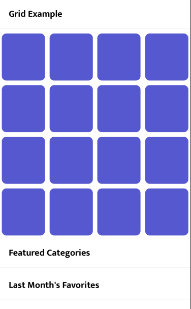

<!-- v -->

## In Class Activity

Complete the sections for `FavoriteSection` and `FeaturedSection`.

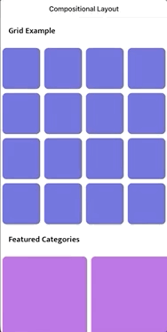

<!-- v -->

## Lab + After Class

Create a View Controller for the subscription box app to display several sections.

- Featured categories
- Last month's favorite items

This view controller will become our home screen in the future, for now don't worry on how to get there. You can add it to one of your buttons in the main menu.

You can see how it should look like in [the online design](https://zpl.io/bejlAMq). It's the "NewHome" screen.

<!-- > -->

## Additional Resources

Today's activity was based on a chapter in Swift For Good Vol.1 by Craig Clayton (@thedevme)<br>
[WWDC - Advances in CollectionView Layout](https://developer.apple.com/videos/play/wwdc2019/215/)<br>
[Tutorial - Compositional Layouts & Diffable data sources](https://medium.com/@yoellev8/diffable-data-sources-compositional-layouts-part-1-2-90f53f120fdc)<br>
[Ray Wenderlich tutorial](https://www.raywenderlich.com/5436806-modern-collection-views-with-compositional-layouts)
[App Store Layout - Article](https://jayeshkawli.ghost.io/ios-13-building-app-store-layout-using-uicollectionview-composite-layout/)
