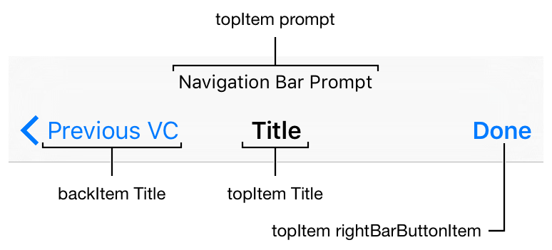

# Manual Navigation

## Lesson Overview
| **Time(min)** | **Activity**                            |
| ------------- | ----------------------------------------|
| 5             | Review of Last Class & Objectives       |
| 10            | TT Manual Navigation                    |
| 20            | Demo                                    |
| 10            | Break                                   |
| 25            | Challenge                               |
| 25            | Mood Tracker Pt. 3 & 4                  |
| 5             | Wrap up                                 |

## Objectives & Competencies
By the end of this lesson, students should be able to:

- Setup a project without storyboard.
- Instantiate ViewControllers without storyboards.
- Navigate between view ViewControllers programmatically.

## MapView (review)

- Enabling Capabilities
- `import MapKit`
- MKMapView
- Map Delegate
- Annotations
  - Title : String
  - Subtitle : String
  - Position : CLLocationCoordinate2D (lat, long)
- MKAnnotation protocol


## UINavigationController

A UINavigationController allows you to manage a large number of view controllers in a stack.

Steps to setup a project with a navigation controller without a Storyboard.

1. First we need to delete the storyboard file.
2.  Then remove the storyboard name on Project Navigator > Select Project > General > Deployment Info > Main Interface

3.  Now we need to change the AppDelegate, to tell our app what to use as the initial ViewController.

```swift
class AppDelegate: UIResponder, UIApplicationDelegate {

    var window: UIWindow?

    var navigationController: UINavigationController?

    func application(_ application: UIApplication, didFinishLaunchingWithOptions launchOptions: [UIApplicationLaunchOptionsKey: Any]?) -> Bool {
        // Override point for customization after application launch.

        window = UIWindow(frame: UIScreen.main.bounds)

        if let window = window {
            let mainVC = ViewController()
            navigationController = UINavigationController(rootViewController: mainVC)
            window.rootViewController = navigationController
            window.makeKeyAndVisible()
        }

        return true
    }

}
```
Programmatically we defined a UINavigationController.
Then we created an instance of ViewController to set it as the root view controller of UINavigationController.

Then we need to tell the main window what to show at the start. In this case we assign our navigationController as the root of the main window.

## Navigation



### Presenting
```swift
let nextVC = ViewController()
self.navigationController?.pushViewController(nextVC, animated: true)
```

(In case you still have storyboard)

```swift
let mainStoryboard = UIStoryboard(name: "Main", bundle: nil)
guard let nextVC = mainStoryboard.instantiateViewController(withIdentifier: "nextVC") as? ViewController else {
  return print("storyboard not set up correctly, check the identity of \"nextVC\"")
}

present(nextVC, animated: true, completion: nil)Â
```
### Dismissing

If presented using modal.

```swift
self.dismiss(animated: true, completion: nil)
```
If using push.

```swift
self.navigationController?.popViewController(animated: true)
```

### Changing rootViewController

Scenarios: <br>
User al ready logged in and then closes the app.<br>
User logged out.


```swift
extension UINavigationController {
    /**
     It removes all view controllers from navigation controller then set the new root view controller and it pops.

     - parameter vc: root view controller to set a new
     */
    func initRootViewController(vc: UIViewController, transitionType type: String = "kCATransitionFade", duration: CFTimeInterval = 0.3) {
        self.addTransition(transitionType: type, duration: duration)
        self.viewControllers.removeAll()
        self.pushViewController(vc, animated: false)
        self.popToRootViewController(animated: false)
    }

    /**
     It adds the animation of navigation flow.

     - parameter type: kCATransitionType, it means style of animation
     - parameter duration: CFTimeInterval, duration of animation
     */
    private func addTransition(transitionType type: String = "kCATransitionFade", duration: CFTimeInterval = 0.3) {
        let transition = CATransition()
        transition.duration = duration
        transition.timingFunction = CAMediaTimingFunction(name: CAMediaTimingFunctionName.easeInEaseOut)
        transition.type = CATransitionType(rawValue: type)
        self.view.layer.add(transition, forKey: nil)
    }
}
```
## Demo/Activity
Using the project for last class (segues), make the navigation programmatically and delete the segues and unwinds.

## Baseline Challenges

1. Using the project you completed for this class using MapKit:
  - Delete the storyboard.
  - Create a new VC that will serve as a Login screen. This screen will only have a button to continue to the map. Add constraints to the button using the anchor approach.
  - Modify the AppDelegate to start with the Login screen.
  - You will need to instantiate the [MKMapView](https://developer.apple.com/documentation/mapkit/mkmapview) programmatically.
  - Add a [UIBarButtonItem](https://developer.apple.com/documentation/uikit/uibarbuttonitem) in the map screen to Logout and handle the action.<br>

1. Continue working on the Mood Tracker app with [part 3](https://github.com/Product-College-Labs/mood-tracker/blob/master/content/7.1-content.md) and [part 4](https://github.com/Product-College-Labs/mood-tracker/blob/master/content/8.1-content.md)

## Resources

[Manual Navigation](https://medium.com/whoknows-swift/swift-the-hierarchy-of-uinavigationcontroller-programmatically-91631990f495)
