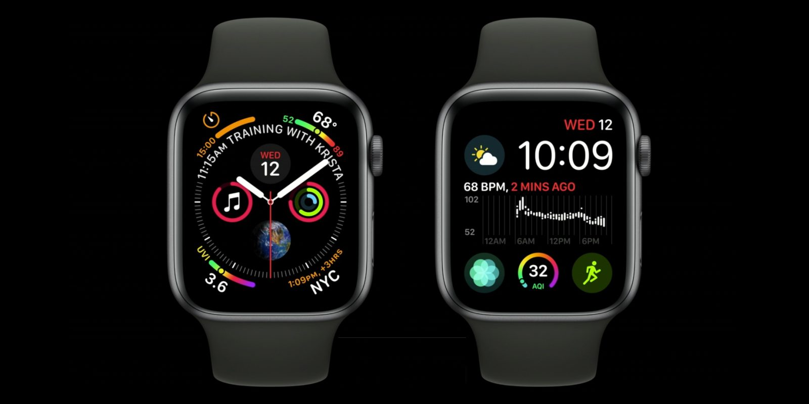
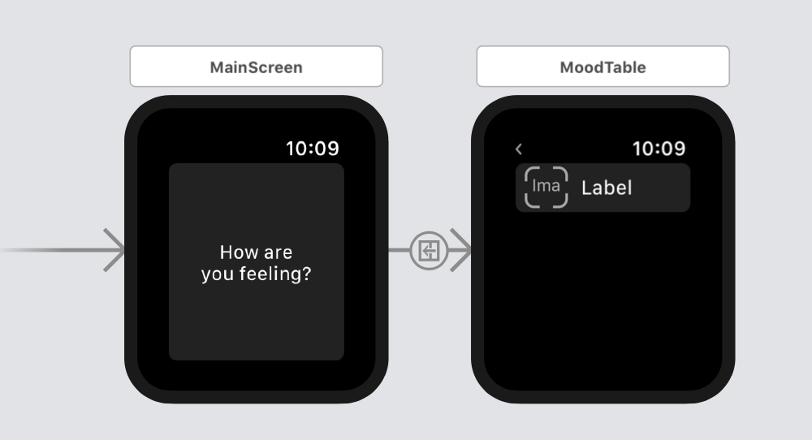

# Apple Watch Extension

## Minute-by-Minute
| **Time(min)** | **Activity**                            |
| ------------- | ----------------------------------------|
| 5             | Review of Last Class & Objectives       |
| 15            | TT WatchOS                              |
| 20            | Creating the interface                  |
| 10            | Break                                   |
| 20            | Setting up the table                    |
| 25            | Setting up the connectivity             |
| 5             | Wrap up                                 |

## Class Learning Objectives/Competencies
By the end of this lesson, students should be able to:

- Add a watchOS target to an existing iOS app.
- Share data across the two targets.
- Manage storyboards to layout interface objects for the watch.
- Manage WKInterfaceController to setup functionality.


## Intro to Apple Watch

WatchOS apps are written using a framework called WatchKit. The code runs on the watch, but since the Apple Watch is tightly linked to the iPhone, writing apps for it also means writing an iOS app.

WatchOS apps can provide 4 different components for the user:

| **Component** | **Description**                            |
| ------------- | ----------------------------------------|
| Full app      | Behave in a similar way to iPhone apps and cane have multiple screens and interactions.      |
| Glance        | Single screens of content to display information. They don't have interactive elements. If the user taps on them, the full app is launched.|
| Notifications | Appear when the iOS app receives notifications. Can come from Apple Push Notification service or can be local notifications.|
| Complications | Small elements embedded into certain watch faces. Not interactive, but can give more information in a quick manner.|



## How the Apple Watch works

WatchOS apps are embedded inside iOS apps. Whenever users download and install an iOS app that contains a watchOS app, the app will automatically be available to install on the watch. watchOS apps are independent apps that run entirely on the watch.

- They do their own processing
- Manage their own memory
- Can store files on the watch (VERY limited)

But they need a parent iPhone app to access any other data (not an iPod touch, nor an iPad).

To communicate with the parent app, we use the    `WatchConnectivity` framework to send and receive files, or small chunks of information.

## Adding the WatchOS target


Select File -> New -> Target <br>
Then choose watchOS -> Application -> WatchKit App ->
Next

In the following screen, set Product Name to `WatchMoodTracker`, Language should be Swift, and uncheck any checkboxes that are checked.<br>
Finish.

We'll be asked if we want to activate the watch scheme, which we do, so make sure to choose Activate.

We'll notice this action actually created two targets, not one, and two corresponding groups in the Project navigator. This is because the code of a Watch app actually runs as an extension bundled within the Watch app, in much the same way Today extensions on iOS work.

Here’s the pattern we'll follow moving forward: any code we add must reside within the Watch Extension group, and be added to the Watch Extension target, whereas any assets or storyboards must be added to the Watch group.

We will be sharing the file `Moodentry` in both targets so find the Target Membership section in the File inspector, and check Watch Extension for that file too.

## Controls in Apple WatchOS

When designing a WatchKit app, we have limited tools to choose from. If we scroll through the Object Library we'll see the available elements. The only way to add them to the interface is through the Interface Builder (unlike iOS where we create elements during runtime). The only way is using outlets.

Another thing to consider is that our code will never retrieve data from these controls. Ex. There are setter methods like `setText` for labels, but no getter methods like `text`.

## Creating an interface controller
To create an interface controller we subclass the WKInterfaceController class and add our actions and outlets. These are some methods the subclass should implement:

- `awakeWithContext`: called when loaded, here we prepare interface objects and give them their initial values.
- `willActivate`: called when the interface controller is about to be shown to the user.
- `didDeactivate`: called when the interface controller is no longer visible.

We'll need to create the following interfaces.



- The first Interface only has a `UIButton`.
  - Set title to "How are you feeling?"
  - Width & Height are relative to container
  - Segue to next screen of type push


- The second Interface has a `UITableView` with a `UIImageView` and `UILabel` in the cell.
  - Label and image inside a Group.
      - Image relative to container (30% W & 85% H, Left, Center)
      - Label relative to container (70% W & 100% H, Left, Center)

# Tables

WKInterfaceTables are optimized to support preparing the entire content of the list all at once. At design time, we define a number of row types. For each type of row, we lay out the controls that go inside and give the row an identifier. Then at runtime we tell the WKInterfaceTable the number of cells and the row type. This creates instances of all of the row controller classes.

Create a new file called `MoodRow`, a subclass of NSObject.

Lets go to the row controller in the Interface Builder and set the identifier of the row to `moodRow`. Also change the class to `MoodRow`.

After connecting the outlets and setting the contents, the file should look like this:

```swift
class MoodRow: NSObject {

    @IBOutlet weak var moodImg: WKInterfaceImage!
    @IBOutlet weak var moodLabel: WKInterfaceLabel!

    var moodObj: MoodEntry? {
        didSet {
            guard let moodObj = moodObj else { return }
            moodImg.setImage(UIImage(named: moodObj.mood.stringValue))
            moodLabel.setText(moodObj.mood.stringValue)
        }
    }
}
```
Now lets tell the `MoodController` how many rows we need. to do that lets create all the possible options to choose from.
First make sure you have the outlet for the table.
`    @IBOutlet weak var table: WKInterfaceTable!
`

Now the options.
```swift
var entries: [MoodEntry] = []

// Inside awake method
let goodEntry = MoodEntry(mood: .good, date: Date())
let badEntry = MoodEntry(mood: .bad, date: Date())
let neutralEntry = MoodEntry(mood: .neutral, date: Date())
let amazingEntry = MoodEntry(mood: .amazing, date: Date())
let terribleEntry = MoodEntry(mood: .terrible, date: Date())

entries = [goodEntry, badEntry, neutralEntry, amazingEntry, terribleEntry]

table.setNumberOfRows(entries.count, withRowType: "moodRow")
```
As we said before, here we need to create all the cells needed as opposed to iOS, where we can reuse them.

```swift
for index in 0..<entries.count {
  guard let controller = table.rowController(at: index) as? MoodRow else { continue }
  controller.moodObj = entries[index]
}
```
## Watch Watch Connectivity

`import WatchConnectivity` needed to communicate between the watch and the iPhone.

All the interaction is going to happen through a WCSession object. Using the default session.

`ExtensionDelegate`, inside `applicationDidBecomeActive()`

```swift
if WCSession.isSupported(){
  WCSession.default.delegate = self
  WCSession.default.activate()
}
```
Plus:

```swift
func session(_ session: WCSession, activationDidCompleteWith activationState: WCSessionActivationState, error: Error?) {
  if error != nil {
    print("Error: \(error)")
  }else{
    print("Ready to communicate with iOS device.")
   }
}
```

Back in the MoodController:

```swift
override func table(_ table: WKInterfaceTable, didSelectRowAt rowIndex: Int) {
  let mood = entries[rowIndex]

  if WCSession.default.isReachable == true {
    // App is reachable
    WCSession.default.transferUserInfo(["mood":mood.mood.stringValue, "date": mood.date])
  }
  pop()
}
```

Here we took the mood in the index that corresponds to the selection and then send it over WCSession. `transferUserInfo` send a dictionary with simple data (strings, numbers, dates, NSData objects, arrays or dictionaries of these types).

We are not done yet. We still haven't set up the counterpart of the connectivity in the iOS app.

Let's go to the ViewController with the table and add the same validation to activate the session as before.

Then add the needed methods.

```swift

//Watch connectivity

func session(_ session: WCSession, activationDidCompleteWith activationState: WCSessionActivationState, error: Error?) {
    if error != nil {
        print("Error: \(error)")
    }else{
        print("Ready to communicate with apple watch.")
    }
}

func sessionDidBecomeInactive(_ session: WCSession) {
    print("Inactive")
}

func sessionDidDeactivate(_ session: WCSession) {
    print("Deactivated")
    WCSession.default.activate()  
}

func session(_ session: WCSession, didReceiveUserInfo userInfo: [String : Any] = [:]) {
    DispatchQueue.main.async {
        print("This is the user info \(userInfo)")

        guard let mood = userInfo["mood"] as? String, let date =  userInfo["date"] as? Date else{ return}
        let newEntry : MoodEntry!

        switch mood {
        case "Amazing":
            newEntry = MoodEntry(mood: .amazing, date: date)
        case "Good":
            newEntry = MoodEntry(mood: .good, date: date)
        case "Bad":
            newEntry = MoodEntry(mood: .bad, date: date)
        case "Terrible":
            newEntry = MoodEntry(mood: .terrible, date: date)
        case "Neutral":
            newEntry = MoodEntry(mood: .neutral, date: date)
        default:
            return
        }

        self.entries.append(newEntry)
        self.tableView.reloadData()
    }

}
```

## Result


## Wrap Up
Finish the watch implementation.

## Additional Resources

Book - [Swift Development for the Apple Watch](http://www.allitebooks.in/swift-development-apple-watch/)
