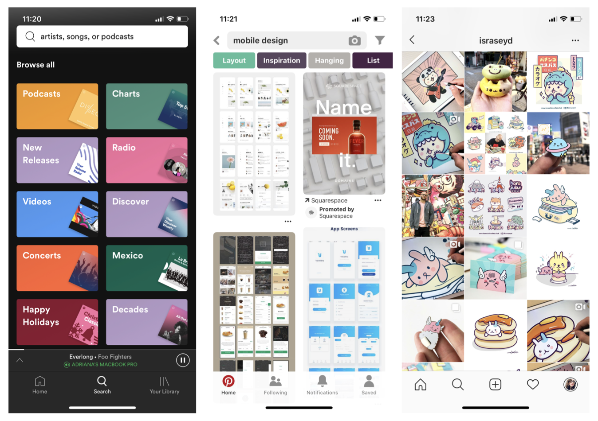
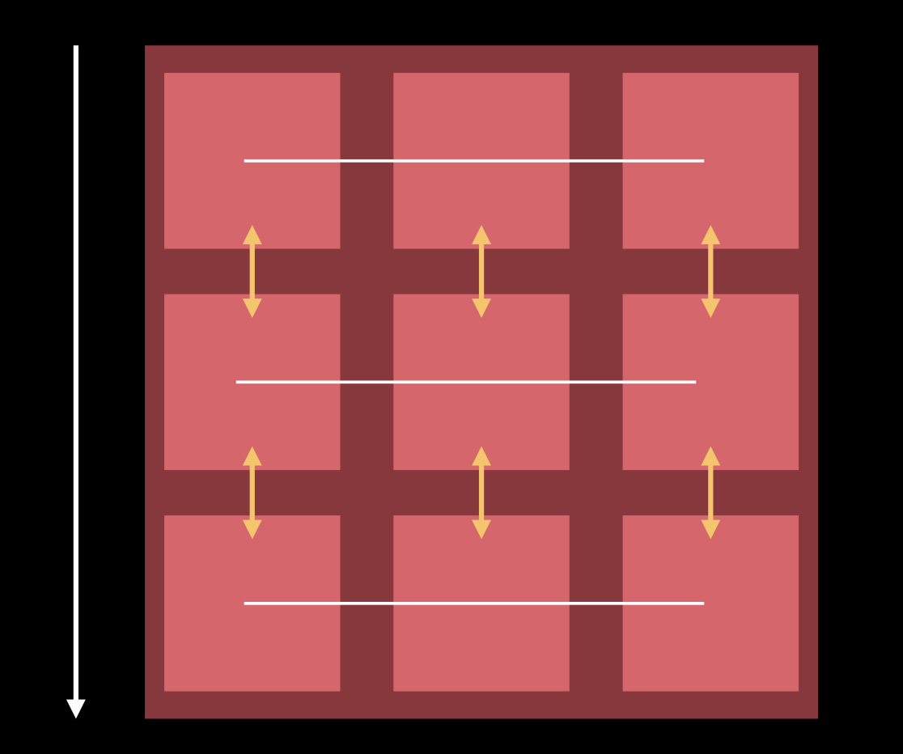
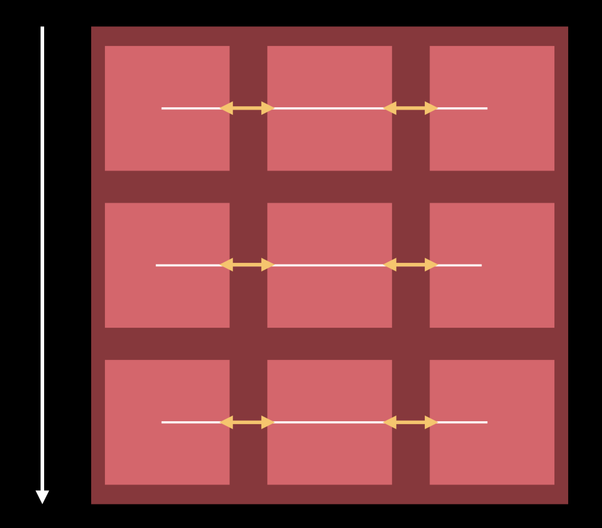
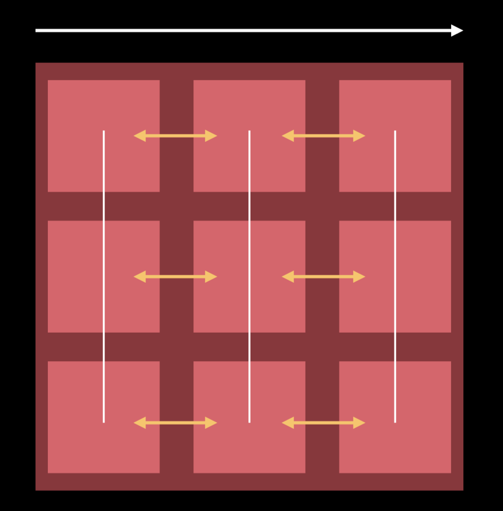
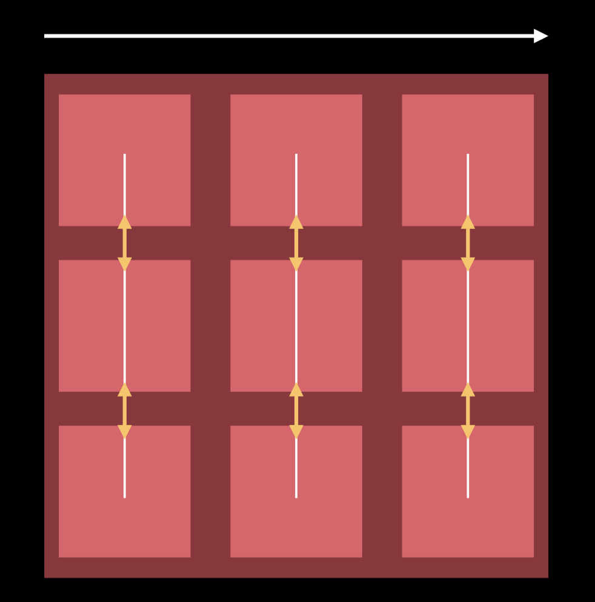
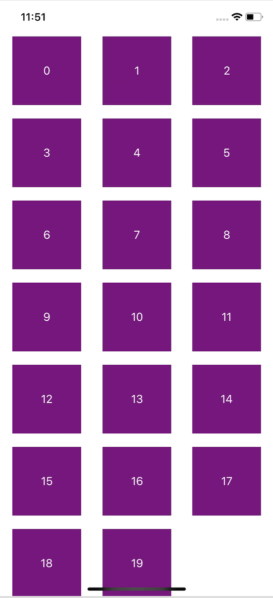

# UICollectionViews

## Lesson Overview
| **Time(min)** | **Activity**                            |
| ------------- | ----------------------------------------|
| 5             | Review of Last Class & Objectives       |
| 15            | TT UICollectionView                     |
| 10            | Demo                                    |
| 20            | Challenge completing the collection view|
| 10            | Break                                   |
| 15            | TT performBatchUpdates                  |
| 25            | Challenge updating datasource           |
| 5             | Wrap up                                 |

## Objectives & Competencies
By the end of this lesson, students should be able to:

- Implement UICollectionViews in code
- Handle UICollectionViews datasource and delegate
- Manage update animations

## UICollectionView

**An object that manages an ordered collection of data items and presents them using customizable layouts.**

We find them in many Apple apps used to display a collection of items.

Instagram/Pinterest - Items are Photos<br>
Spotify - Items are genres, artists or songs



## Layout

Just like `UITableview`, `UICollectionView` has a datasource and a delegate. What's different is another concept known as Layout.

Layout is everything that deals with *where* the content is displayed.<br>
Each individual item is specified by the `UICollectionView` layout attributes (bounds, center, frame...) These properties are used to define the **items** in the collection view.

Layout is immutable. If this needs to be changed (ex. change in orientation) we would use the invalidate layout method. The good thing of the layout being separated from the content in the `UICollectionView` is that we can have transitions between layouts with animations. The transitioning layouts don't need to know about each other, they just describe how the arrangement is going to be and then the transition occurs.

`UICollectionViewLayout` is a class that is meant to be subclassed. There is one provided already called **UICollectionViewFlowLayout**.

## Line based design

Flow - line based layout systems that adapts to many designs.

**Vertical Scrolling**<br>
Here we see what happens when the flow layout lays out the items in the collection view.
<br><br>
**Line Spacing**
<br><br>
**Inter item spacing**
<br><br>
**Horizontal Scrolling**<br>
Here we see what happens when the flow layout lays out the items in the collection view.<br>
<br><br>
**Line Spacing**
<br><br>
**Inter item spacing**
<br><br>

Layout provides 2 properties that let us specify the minimum value for both line spacing and inter item spacing.

## Data Source

Deals with what goes as the content of the `UICollectionView`.

```
optional public func numberOfSections(in collectionView: UICollectionView) -> Int

public func collectionView(_ collectionView: UICollectionView, numberOfItemsInSection section: Int) -> Int

public func collectionView(_ collectionView: UICollectionView, cellForItemAt indexPath: IndexPath) -> UICollectionViewCell

```
## Delegate
`UICollectionView` is a subclass of `UIScrollView`. We use the same delegate and we can also extend it.<br>
Handles user interaction with items in the collection view: highlighting, selecting, dragging, etc.

## Setup

1. Instantiate a `UICollectionView` object on our view controller

```
collectionView = UICollectionView(frame: view.bounds, collectionViewLayout: UICollectionViewFlowLayout())
```
3. Set dataSource and delegate of the collection view

```
collectionView.dataSource = self
collectionView.delegate = self
```
4. Create a cell and layout the contents inside
5. Register cell & reuse identifier

```
// Inside cell
static var identifier: String = "Cell"
// Inside view controller
collectionView.register(Cell.self, forCellWithReuseIdentifier: Cell.identifier)

```
6. Implement methods needed from dataSource and delegate.


## Baseline Challenges

1. Download the [starter project](https://github.com/amelinagzz/collectionviews-starter) and finish the implementation of the `UICollectionView`.
2. Experiment changing the values in the flow layout until you achieve something like this.

<br><br>

3. Now instead of using the default flow layout. Use the subclass `CustomFlowLayout`.
```
let flow = CustomFlowLayout()
let collectionView = UICollectionView(frame: view.bounds, collectionViewLayout: flow)
```
We won't be using the methods in the flow extension so we can comment that out for now.

4. The new layout displays one column only. Run it and see how it looks in both portrait and landscape mode. Run the project to see if you get the single column in both orientations.

5. This works ok but we can make better use of the space when it's on landscape mode by having more columns.

```
let availableWidth = cv.bounds.inset(by: cv.layoutMargins).size.width
let minColumnWidth = CGFloat(300)
let maxNumColumns = Int(availableWidth/minColumnWidth)
let cellWidth = (availableWidth / CGFloat(maxNumColumns)).rounded(.down)

self.itemSize = CGSize(width: cellWidth, height: 70.0)

```

Try the code above and see how we can optimize the space. Every time our device rotates, the previous layout invalidates and the new one recalculates the item size.

## Using performBatchUpdates

It is a common situation when a collection view needs to update the arrangement of its items. Deleting, adding and moving items can be done using animations instead of calling `reloadData()` this will result in a better user experience.

We can use the performBatchUpdates API to trigger several updates on the collectionView at the same time.

```
func performBatchUpdates(_ updates: (() -> Void)?, completion: ((Bool) -> Void)? = nil)
// allows multiple insert/delete/reload/move calls to be animated simultaneously. Nestable.
```
When doing this operations we need to be careful with the order of handling the datasource and triggering the animations. <br><br>
The order of *collection view updates* **won't** matter.<br>
The order of the *updates* in the datasource **does** matter<br>

### Guidelines for updates
- Decompose Move into Delete and Insert updates
- Combine all Delete and Insert updates
- Process Delete updates first, in descending order
- Process Insert updates last, in ascending order

## Challenge - fixing the updates

The sample project has a nav bar button with the title "update".

When we tap the "Example" option, these are the things that should happen:

- Update the value of the item at position 3
- Delete the item at position 2
- Move the item at position 3 to position 0

Try it now and see what happens. Does it work? What's wrong?

## Challenge - more updates
The last part of this challenge will be completing the rest of the options in the "Update" menu.
Take into consideration the guidelines to avoid crashing the app.

## External Resources
[WWDC Demo on UICollectionView](https://developer.apple.com/videos/play/wwdc2018/225/?time=514)<br>
[UICollectionViews programmatically](https://theswiftdev.com/2018/06/26/uicollectionview-data-source-and-delegates-programmatically/)<br>
[Starter project](https://github.com/amelinagzz/collectionviews-starter)
