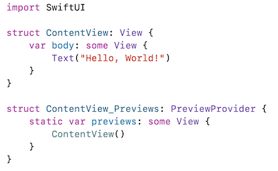

# Exploring SwiftUI

## [Slides](https://make-school-courses.github.io/MOB-1.2-Introduction-to-iOS-Development/Slides/11-SwiftUI/README.html ':ignore')

<!-- > -->

## Learning Objectives

By the end of this lesson, students should be able to:

- Explain what is SwiftUI and how it works with Declarative syntax
- Familiarize with creating views following a tutorial
- Implement their own view in SwiftUI to build a profile
- Combine SwiftUI and UIKit in a project

<!-- > -->

## SwfitUI


SwiftUI is an innovative way to build user interfaces across all Apple platforms using Swift.  

<!-- > -->

## Declarative syntax

*Declarative programming is a non-imperative style of programming in which programs describe their desired results without explicitly listing commands or steps that must be performed.*

Telling SwiftUI **what** we want the UI to look like and work, then it figures out **how** to make that happen.  

- Easy to read
- Natural to write

<!-- > -->


<aside class ="notes">
Note how this code on the left creates a fully working table on the right. And just in a few lines of code.
</aside>

<!-- > -->

## Design Tools

With Xcode 11 came a lot of new tools to work with SwiftUI.

As we work in the code editor, we get to see a live preview of the app.

As we work in the design canvas, everything we edit is in sync with the code editor.

In any case, Xcode recompiles the changes instantly and inserts them into a running version of your app, visible, and editable at all times.

<!-- > -->

## Some facts

- SwiftUI runs on iOS 13, macOS 10.15, tvOS 13, and watchOS 6. And future versions of each.
- SwiftUI does not replace UIKit.
- SwiftUI uses AutoLayout behind the scenes. And also a flexible box layout system.
- SwiftUI is faster than UIKit.
- You can have a project than mixes SwiftUI and UIKit.

<!-- > -->

## Template contents



<aside class = "notes">
A view is a rectangular area on the screen where we can display content and interact with it.

In the template contents we have `body` that behaves like a view.

</aside>

<!-- > -->

## Warmup

Initial activity can be:

- Adding multiple views and arranging them in a grid.
- Adding a few views and turning them into circles of different colors.
- Stretch: Adding an action when tapping on the elements (can be a print statement)

<!-- > -->

## In Class Activity

Complete the section ["Creating and Combining Views"](https://developer.apple.com/tutorials/swiftui/creating-and-combining-views) from the SwiftUI tutorials by Apple.

<!-- > -->

## What should we learn?

For now SwiftUI has limited API coverage, limited adoption and support.

It will be a big deal in years to come (maybe 2 or 3). But as iOS developers in the job industry **now**, we need to know about UIKit as a requirement.

The best option is to learn SwiftUI on the side as well once you feel comfortable with UIKit (a list of resources at the end of the lesson).

<!-- > -->

## In Class Activity

Using SwiftUI create the following layout for a Profile view.


<!-- > -->

## Adding it to an existing project.

If you need to add the ViewController you created with SwiftUI, you can use it as a regular view in a project that mostly uses UIKit, using the class [UIHostingController](https://developer.apple.com/documentation/swiftui/uihostingcontroller).

You will need to add the SwiftUI file to the project.

Then just use it as a regular view with the help of the class

```swift
let swiftUIView = ContentView()
let viewController = UIHostingController(rootView: swiftUIView)
```

<!-- > -->

## Additional Resources

- [What is SwiftUI](https://developer.apple.com/xcode/swiftui/)
- [SwiftUI tutorials](https://developer.apple.com/tutorials/swiftui/tutorials)
- [100 days of SwiftUI](https://www.hackingwithswift.com/100/swiftui)
- [SwiftUI by examples](https://www.hackingwithswift.com/quick-start/swiftui)
