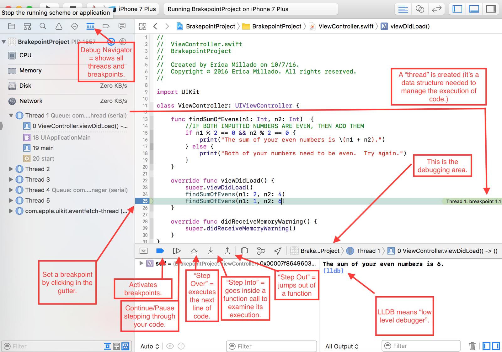
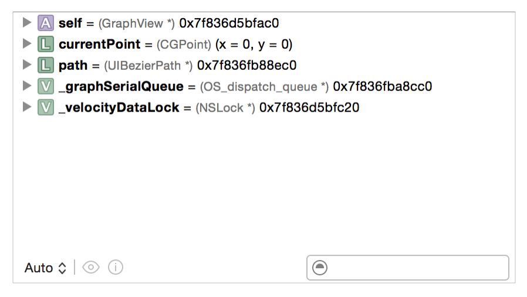
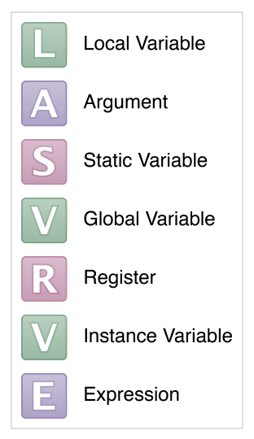

# Inspecting and Debugging Your Code

## Lesson Overview

| **Time(min)** | **Activity**                              |
| ------------- | ---------------------------               |
| 5             | Intro & Objectives                        |
| 15            | TT on breakpoints                         |
| 30            | Work on challenge                         |
| 10            | Break                                     |
| 15            | TT on debugging                           |
| 30            | Work on challenge                         |
| 5             | Wrap up & Q&A                             |

## Objectives & Competencies
By the end of this lesson, students should be able to:

- Identify and set breakpoints in code
- Find and track bugs using the debugger
- Inspect objects in the debugger

# Lesson

When writing code, you will discover that as you write more code, the potential for bugs in your code increases. Bugs happen and it is expected we spend a lot of our time trying to find and fix bugs. It is just a normal part of being a programmer. Discovering and fixing bugs is a difficult task; it takes time, practice and a knowledge of a few tools to get good at it.

## Crashes
Crash: Sudden termination of  the app when it attempts to do something that it’s not allowed.

*Why do crashes occur?*

- Impossible fo the CPU to execute code (dividing by 0)
-  Operating system is enforcing a policy (the OS kills the app is it’s taking to long to launch or if it has a memory issue)
- Programming language is preventing failure  (trying to access an index out of bounds of an array)
- Developer is preventing failure (looking if a parameter is not nil)

## Debugging with Xcode

Today we will practice our debugging skills by identifying the tools Xcode provides us.

We will use the five (5) recommended steps provided by Apple to fix bugs:

**Discover** - Identify the problem. The first thing we should be able to do is to reproduce the bug. If we can't reproduce the problem, it's likely we don't understand it.

**Locate** - Determine where in the code the problem occurs.
- What line of code caused the error?

**Inspect** - Examine the control flow and data structures of the running code to find the cause of the problem.
- What is the value of current variables?
- What methods led to the error?

Generate a hypothesis.

**Fix** - Apply your insight into the cause of the problem to devise a solution, and edit the code.

**Confirm** - After editing, run the app and check it with the debugger to be sure the fix was successful.

## Concepts
- **Logic error**: a bug in a program that causes it to operate incorrectly, but it doesn't terminate the app (crash)

- **Runtime errors**: issues that occur while your application is running (these can be logic errors or errors that cause your application to crash)

- **Software bug**: an error or fault in a computer program or system that causes it to produce an incorrect or unexpected result, or to behave in unintended ways.

- **Static (or compilation) errors**: issues identified by the compiler that must be fixed prior to running your application, these are the ones that prevent you from building the app in Xcode.

- **Warning**: issues that might cause problems or have unintended side-effects on your running application, but they still let us build and run the app

## Debugging tools

### Print statements
We can make use of a simple tool like printing text to the console to examine the content of variables or print messages we consider useful.

`print("Useful message that will help in the future.")`

### Breakpoints
A **breakpoint** is a debugging tool that allows us to *pause* the execution of our program up to a certain moment.  
We use them to create pause points in our code that can help us investigate our code to see where bugs occur.

**How?**
Decide where we need to pause the execution of the code and click in the line number to create a breakpoint. 
- Blue means the breakpoint is active. 
- Grey means it is inactive. 

You can toggle between the 2 states by clicking the breakpoint. 
To remove the breakpoint click on it a drag it to the right, then release.

- Step in - Execute the current line of code and, if the current line is a routine, jump to the first line of that routine
- Step out - Complete the current routine and step to the next routine or back to the calling routine.
- Step over - Execute the current line of code and, if the current line is a function or method, step out to the next line in the current file

### Identifying elements

### Inspecting variables

The variable view provides the primary way to inspect the state of variables when an app is paused.

The variable view lists each variable available in the context where the app is paused. Each variable has an identifying icon, the variable name, type, and value.

### LLDB (low level debugger)

We can type shortcut commands into the LLDB to help us set breakpoints at certain lines of code, set breakpoints at many points in the code, list all the breakpoints, and disable breakpoints.

`breakpoint set --selector viewDidLoad` 
`breakpoint list` 
`breakpoint disable`

We can also review the content of variables.

`po variableName`

## Baseline challenge

Clone this repo from Udacity, we'll use it to debug the app and fix it. 
`git clone https://github.com/udacity/ios-nd-debugging`

## Crashlytics
[Firebase](https://firebase.google.com) 
`mdfind "com_apple_xcode_dsym_uuids == <UUID>"`

## Baseline challenge
Add your app to Crashlytics and make it crash to get a report on the dashboard.

## External resources
[Udacity course on debugging](https://www.udacity.com/course/xcode-debugging--ud774) 
[LLDB](https://developer.apple.com/library/archive/documentation/IDEs/Conceptual/gdb_to_lldb_transition_guide/document/lldb-basics.html#//apple_ref/doc/uid/TP40012917-CH2-SW1) 
[Debugging with Xcode](https://developer.apple.com/library/archive/documentation/DeveloperTools/Conceptual/debugging_with_xcode/chapters/debugging_tools.html#//apple_ref/doc/uid/TP40015022-CH8-SW19) 
[Article on breakpoints](https://medium.com/yay-its-erica/xcode-debugging-with-breakpoints-for-beginners-5b0d0a39d711)
